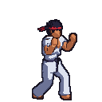
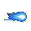
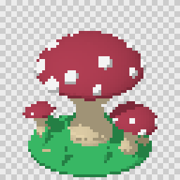
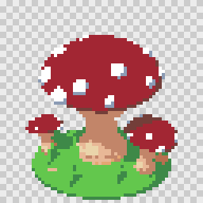
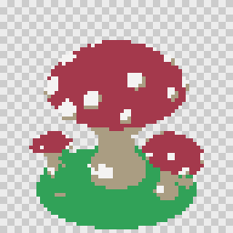
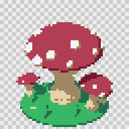

# td2d

td2d (threedee-twodee) is a starter kit for generating pixel art for your project. It has everything needed to model figures, props and scenery in 3D and bake them into 2D sprites and sprite sheets, from every direction and animation frame, ready for your engine.

It is designed to be agent first. You describe what you want, the agent builds it and shows you a preview, and you describe changes until it is right. It is best started with references to your game's existing art: the agent studies them and sets td2d's palette, camera, outline, shading and sprite sizes to match.

It adapts and grows with your project. Every palette, preset, reusable component and asset you settle on is saved as a file in your project, so each new asset starts from everything you have already refined, and the more you use it, the better it fits your game keeping scaling and style consistent. td2d itself is a deterministic command-line tool: the same definition always gives the same sprites, so a change you ask for changes only what you asked for. See [Set up in your game with Claude](#set-up-in-your-game-with-claude) to get started.


   

> **Status: every phase of the [roadmap](ROADMAP.md) is implemented and tested; the packages are not yet published to npm.** Until they are, td2d runs from a clone of this repository (`node <repo>/packages/cli/dist/main.js`). Asset definitions built from 14 part types (shapes, groups, CSG, parameterised components and GLB imports, with repeat and mirror) generate validated pixel-art sprite sheets with Aseprite JSON and a manifest, with stage caching, history and a web viewer. Camera and lighting presets, mirrored and counted directions, automatic framing and ground shadows are in. Pixel processing has fixed and automatic palettes, ordered dithering, outlines, cleanup and indexed PNG output. Characters animate on humanoid or custom rigs, with keyed clips and walk, breathe, bob and spin generators. Sheets can be grids, strips or trimmed packed atlases, exported for Aseprite, PixiJS, Phaser and Godot. Every rendered frame is cached on its own, so an edit rerenders only what changed, and `td2d batch` generates many assets in parallel with a report you can resume. The web viewer shows sheets at exact pixel zoom, plays animations in every direction, compares generations with a swipe or heat map, previews the model in 3D and reloads live; `td2d index` writes it as a static site. Every error has a catalogue entry and `td2d explain`; asset scripts run sandboxed; inputs, time and memory are limited; an optional headless-gl backend renders without a browser.

## How it works

Every asset goes through the same stages. Each stage's result is cached, so an edit reruns only the stages it affects.

| Stage      | What happens                                                                                                           |
| ---------- | ---------------------------------------------------------------------------------------------------------------------- |
| `resolve`  | The asset is merged with the project's defaults and presets into one resolved definition                               |
| `model`    | The parts are built into a 3D model (GLB) and checked                                                                  |
| `rig`      | Characters get a skeleton; each part rides one bone                                                                    |
| `plan`     | Directions, animation frames, scale and framing are worked out                                                         |
| `render`   | A headless browser renders every direction and frame at 4 times the sprite size, with toon shading and no antialiasing |
| `pixel`    | Each render is downscaled, snapped to a palette, dithered, outlined and cleaned up                                     |
| `sheet`    | Sprites are laid out as a grid, strips or a trimmed packed atlas                                                       |
| `validate` | Size, transparency, framing, grounding and colour count are checked                                                    |
| `export`   | Sheets and data files are written for Aseprite, PixiJS, Phaser, Godot, single frames or GIF previews                   |

Because every sprite comes from the same model, camera, light and palette, a whole set of assets stays consistent across directions and frames. That is the hard part of pixel art to do by hand, and it is what td2d is best at.

## Is it right for your game?

td2d is a good fit for:

- props, buildings, environment pieces, tiles and items;
- chunky or stylised characters that read clearly at small sizes;
- anything that needs four, eight or sixteen directions;
- prototypes and placeholder art that should still look like one coherent game.

Things to know before you start:

- **The art is only as good as the model.** Models are made from primitives, CSG and components, or imported as GLB from a tool such as Blender. Faces, cloth and organic shapes take an imported model, and texture support is limited.
- **It does not learn a style from images.** Your style is expressed as settings: palette, outline, dither, shading, camera, scale and frame size. Claude can study your existing art and choose those settings for you; see [Matching your game's style](#matching-your-games-style).
- **Animation is rigid.** Each part rides one bone, so limbs do not bend smoothly, and there is no inverse kinematics. Clips are keyed by hand or generated (walk, breathe, bob, spin).
- **Cameras are orthographic.** There are no perspective sprites.
- **Hand polish is still hand work.** For hero characters, or where hand-placed pixels give the charm, treat td2d's output as a base to touch up in Aseprite.

## Requirements

- Node.js 24 or newer.
- pnpm, to build this repository. It is pinned in `package.json`; without a global pnpm, `npx pnpm@12.8.1 <command>` works.
- A headless Chromium for rendering, which `td2d doctor --fix` installs once per machine. On Linux it may also need system libraries: `npx playwright install-deps chromium`.

## Install

Clone and build this repository once:

```sh
git clone https://github.com/brphillis/threedee-twodee.git
cd threedee-twodee
pnpm install
pnpm build
```

`td2d` is not on your PATH until the packages are published. Run it by its full path, or define a shell function:

```sh
td2d() { node /path/to/threedee-twodee/packages/cli/dist/main.js "$@"; }
```

After you change or update td2d, run `pnpm build` here again: every project uses whatever is in `packages/cli/dist/`.

## Set up in your game with Claude

A td2d project is a folder of JSON files that lives inside your game's repository, usually at `sprites/`. The easiest way to create one and match it to your game is to let Claude Code do it.

1. Build td2d once, as in [Install](#install).
2. Open Claude Code in your game's repository, with access to this one so it can read the guides:

   ```sh
   cd /path/to/your-game
   claude --add-dir /path/to/threedee-twodee
   ```

   In a session that is already open, `/add-dir /path/to/threedee-twodee` does the same.

3. Paste a prompt like the one below, with `/path/to/threedee-twodee` replaced by where you cloned this repository.

```text
Set up td2d (threedee-twodee) in this repository. It is a tool I made for generating pixel-art sprites, and it is cloned at /path/to/threedee-twodee. Do your research first.

1. Read /path/to/threedee-twodee/AGENTS.md, then these guides in /path/to/threedee-twodee/docs/guide: getting-started.md, configuration.md, camera-and-lighting.md, materials-and-palettes.md, pixel-art.md, sprite-sheets.md and export-formats.md. If packages/cli/dist/main.js does not exist there, run `pnpm install && pnpm build` in that repository first.

2. Create the project in this repository's root, so we end up with sprites/:
   node /path/to/threedee-twodee/packages/cli/dist/main.js init sprites
   Then run doctor --fix and validate against it.

3. Before changing any settings, study this repository's existing art and code: its sprites and sprite sheets, their frame sizes, the colours they use, the viewing angle, outlines, shading, how many directions characters face, animation frame rates, and how the game loads sprite sheets (engine, loader, file names and folders).

4. Configure sprites/ to match, using td2d's own settings the way the guides describe:
   - a palette in sprites/palettes/ with the colours our art uses;
   - project defaults and typeDefaults: camera, lighting, pixelsPerUnit, frame sizes, directions, and pixel settings (palette, outline, dither, cleanup);
   - presets in sprites/presets/ for anything we will reuse;
   - the sheet layout and export formats our engine loads;
   - acceptance checks, such as maxColors, so validation catches anything off-style.
   td2d does not learn from images, so turn what you see into these settings. Record each choice and the evidence for it in sprites/README.md.

5. Generate our first asset: a stone statue of a warrior holding a sword, standing on a pedestal. Validate it and fix what validation reports. Preview it, look at the preview yourself, and improve the model until it reads well at our sprite size. Then open the preview for me and tell me where the sheets were written.

Take your time and do each step properly. Run every td2d command with --json.
```

Claude will build td2d if it needs to, create `sprites/`, read your existing art, write the palette and settings, then model, generate and refine the statue. `AGENTS.md` is written for exactly this: it tells an agent how to call td2d from any directory, read its JSON output and exit codes, and look up part types and options before writing a definition.

Once the project exists, day-to-day requests can be short:

```text
Using td2d in sprites/ (guide: /path/to/threedee-twodee/AGENTS.md), make a wooden market stall prop in our style, then show me the preview.
```

```text
Add an eight-direction villager character on the humanoid rig with idle and walk clips, export it for our engine, and open it in td2d viewer.
```

To make every session in your game's repository know about td2d, copy the setup lines from `AGENTS.md` into that repository's `CLAUDE.md`.

## Set up by hand

The same steps without Claude:

```sh
cd /path/to/your-game
td2d init sprites          # copies the starter template; never overwrites files
cd sprites
td2d doctor --fix          # once per machine: installs the headless Chromium
td2d validate              # every definition, no rendering
td2d generate props/crate  # the full pipeline for the sample asset
td2d preview props/crate   # an enlarged PNG with cell borders
td2d viewer --open         # browse every generated asset
```

`init` creates:

| Path                            | Purpose                                                                      |
| ------------------------------- | ---------------------------------------------------------------------------- |
| `td2d.project.json`             | Project name and defaults applied to every asset                             |
| `assets/props/crate/asset.json` | An example asset                                                             |
| `.td2d/schemas/`                | JSON Schemas that editors use through each file's `$schema`                  |
| `.gitignore`                    | Ignores generated output: `build/`, `history/`, `.td2d/cache/`, `.td2d/tmp/` |

The folder holds only JSON, and every `$schema` path is relative, so it can be moved anywhere. td2d finds the project by looking for the nearest `td2d.project.json` above the current directory, or uses `--project <dir>`. Generated sheets go to `build/`, which is not committed: generate them as a build step, or copy them to wherever your game loads sprites from.

## A project at a glance

```text
sprites/
  td2d.project.json        project name, defaults and typeDefaults
  assets/<group>/<name>/   one asset.json per asset, such as assets/props/statue/asset.json
  palettes/                your own palettes, such as palettes/my-game.json
  presets/<kind>/          your own camera, lighting, pixel, sheet, export and rig presets
  components/              reusable parameterised parts
  build/                   generated sheets, manifests and validation reports
```

An asset is a list of parts with materials, a frame size, directions and animation clips. This is the sample crate:

```json
{
  "$schema": "../../../.td2d/schemas/asset.schema.json",
  "schemaVersion": "1.0.0",
  "id": "props/crate",
  "type": "prop",
  "description": "Wooden supply crate with an iron band.",
  "frame": { "width": 32, "height": 32 },
  "directions": "d4",
  "materials": {
    "wood": { "color": "#a0693a", "shading": "toon", "bands": 3 },
    "iron": { "color": "#5b6770", "shading": "toon", "bands": 2 }
  },
  "model": {
    "parts": [
      {
        "type": "box",
        "id": "body",
        "material": "wood",
        "size": [1, 1, 1],
        "position": [0, 0.5, 0]
      },
      {
        "type": "box",
        "id": "band",
        "material": "iron",
        "size": [1.04, 0.12, 1.04],
        "position": [0, 0.5, 0]
      }
    ]
  },
  "animation": { "fps": 10, "clips": { "idle": { "duration": 0.1 } } },
  "acceptance": { "minAlphaCoverage": 0.15 }
}
```

Units are metres with Y up; one metre is `pixelsPerUnit` pixels (16 by default). The part types are `box`, `cylinder`, `cone`, `sphere`, `capsule`, `torus`, `plane`, `wedge`, `lathe`, `extrude`, `group`, `csg`, `component` and `import`. Asset types are `prop`, `character`, `tile` and `effect`, each with its own defaults. See [Building models](docs/guide/models.md).

Settings are layered, later layers winning: built-in defaults, built-in defaults for the asset's type, the project's `defaults`, the project's `typeDefaults.<type>`, then the asset itself. `td2d asset show <id>` prints an asset with every layer applied, exactly as generation will use it.

## Matching your game's style

Everything that makes up a pixel-art style is a setting, and setting it once in the project applies it to every asset:

| Part of the style | Setting                                                                                                              |
| ----------------- | -------------------------------------------------------------------------------------------------------------------- |
| Colours           | A palette in `palettes/<name>.json`, used as `"palette": "fixed:<name>"`; or `auto:<n>` to build one from each asset |
| Outline           | `pixel.outline`: colour, `outside` or `inside`, width, 4 or 8 connectivity, snapped to the palette or not            |
| Dithering         | `pixel.dither` (`bayer-2`, `bayer-4`, `bayer-8`) and `ditherStrength`                                                |
| Shading           | Material `shading` (`toon`, `lambert`, `flat`) and toon `bands`                                                      |
| Light             | Lighting presets: `studio-toon`, `studio-rim`, `world-sun`, `flat`                                                   |
| Viewing angle     | Camera presets: `dimetric`, `isometric`, `three-quarter`, `top-down-45`, `side`, `top`                               |
| Detail and size   | `pixelsPerUnit` and `frame`                                                                                          |
| Directions        | `d1`, `d4`, `d8`, `d16`, or compass names such as `["s", "e"]`                                                       |
| Stray pixels      | `pixel.cleanup`                                                                                                      |
| Staying on style  | `acceptance.maxColors` and the other acceptance checks                                                               |

A palette file:

```json
{
  "schemaVersion": "1.0.0",
  "name": "my-game",
  "description": "Colours taken from the game's existing art.",
  "colors": [
    "#1a1c2c",
    "#5d275d",
    "#b13e53",
    "#ef7d57",
    "#ffcd75",
    "#a7f070",
    "#38b764",
    "#257179",
    "#29366f",
    "#3b5dc9",
    "#41a6f6",
    "#73eff7",
    "#f4f4f4",
    "#94b0c2",
    "#566c86",
    "#333c57"
  ]
}
```

A project that applies it, with a top-down RPG camera, an outline, a light dither, eight-direction characters and exports for Aseprite and GIF previews:

```json
{
  "$schema": "./.td2d/schemas/project.schema.json",
  "schemaVersion": "1.0.0",
  "name": "my-game",
  "defaults": {
    "camera": "three-quarter",
    "lighting": "studio-toon",
    "pixelsPerUnit": 16,
    "pixel": {
      "palette": "fixed:my-game",
      "dither": "bayer-4",
      "ditherStrength": 0.35,
      "outline": {
        "color": "#1a1c2c",
        "side": "outside",
        "width": 1,
        "snapToPalette": true
      }
    },
    "export": { "formats": ["aseprite-json", "gif-preview"] }
  },
  "typeDefaults": {
    "character": {
      "frame": { "width": 32, "height": 48 },
      "directions": "d8",
      "rig": "humanoid-basic"
    }
  }
}
```

| `none`                                        | `fixed:endesga-32`                                  | `auto:16`                                        | `auto:4`                                        | `fixed:toadstool-7`                             |
| --------------------------------------------- | --------------------------------------------------- | ------------------------------------------------ | ----------------------------------------------- | ----------------------------------------------- |
|  |  |  |  |  |

The [materials and palettes](docs/guide/materials-and-palettes.md), [pixel art](docs/guide/pixel-art.md) and [camera and lighting](docs/guide/camera-and-lighting.md) guides show every option with pictures.

## Getting sprites into your engine

| Engine or tool                              | Format                            |
| ------------------------------------------- | --------------------------------- |
| Aseprite, or any loader that reads its JSON | `aseprite-json`                   |
| Phaser 3 and 4                              | `aseprite-json` or `phaser-atlas` |
| PixiJS 8                                    | `pixi`                            |
| Godot 4                                     | `godot-spriteframes`              |
| Anything else                               | `frames`: one PNG per frame       |
| Previews for people                         | `gif-preview`                     |

Set the formats with `export.formats`, or use the `everything` export preset. Every asset also gets `sheets/manifest.json`, which records each cell, the pivot where the sprite stands, and the palette. Sequences are named `<clip>_<direction>`, such as `walk_s`. See [Getting sprites into an engine](docs/guide/export-formats.md); `examples/engines` has Phaser and PixiJS pages that play the knight.

## Commands

| Command                                                        | Purpose                                                                              |
| -------------------------------------------------------------- | ------------------------------------------------------------------------------------ |
| `td2d init [dir]`                                              | Create a project from a template. Never overwrites files.                            |
| `td2d doctor [--fix]`                                          | Check Node.js, native modules, the headless browser and the project.                 |
| `td2d schema [name]`                                           | Print the JSON Schema for any document.                                              |
| `td2d describe`                                                | List commands, part types, presets, palettes, templates and error codes.             |
| `td2d validate [ids...]`                                       | Validate definitions, presets and palettes.                                          |
| `td2d asset list / show / create`                              | Manage asset definitions.                                                            |
| `td2d generate [ids...]`                                       | Build, render, pixelate, lay out, validate and export. Unchanged stages are reused.  |
| `td2d inspect <id>` / `td2d preview <id>`                      | Summarise a build, or write an enlarged preview PNG.                                 |
| `td2d model build / inspect <id>`                              | Build and report the geometry only.                                                  |
| `td2d process [ids...]`                                        | Rerun pixel processing and later stages from cached renders.                         |
| `td2d rig list` / `td2d rig show <id>`                         | Rig presets, and an asset's bones with their attached parts.                         |
| `td2d sheet [ids...]` / `td2d export [ids...] --format <list>` | Lay out sheets again, or write export formats, from cached sprites.                  |
| `td2d asset emit <script.ts>`                                  | Write an asset definition from a TypeScript SDK script.                              |
| `td2d render <id>` or `--glb <file> --out <dir>`               | Render an asset or a GLB to transparent PNG frames.                                  |
| `td2d history list / show / prune` / `td2d compare <id>`       | Earlier generations, and a cell-by-cell diff against one.                            |
| `td2d batch`                                                   | Generate many assets with a concurrency limit, `--continue-on-error` and `--resume`. |
| `td2d cache stats` / `td2d cache clean`                        | Cache size, and pruning by age or size.                                              |
| `td2d viewer [--open] [--no-watch]` / `td2d index`             | Read-only web viewer for the build directory, live or as a static site.              |
| `td2d explain <code>` / `td2d completion <shell>`              | What an error or warning code means, and shell completion for bash, zsh and fish.    |

Every command accepts `--json` and then prints exactly one JSON envelope on stdout, with NDJSON logs and progress on stderr. Exit codes say what went wrong: 3 means an input is invalid, 5 means output failed validation, 7 means the environment needs `td2d doctor --fix`. The [CLI guide](docs/guide/cli.md) and [CLI reference](docs/reference/cli.md) cover every option.

## Documentation

- [AGENTS.md](AGENTS.md): the operator guide for Claude Code and other agents.
- [Getting started](docs/guide/getting-started.md): from an empty directory to a validated sprite sheet.
- [Example gallery](docs/guide/examples.md): every example project with its output.
- [docs/](docs/README.md): every guide and reference, including models, rigging and animation, sprite sheets, validation, the viewer, caching and batches, and troubleshooting.

## Repository layout

| Path                      | Contents                                                                                                                                          |
| ------------------------- | ------------------------------------------------------------------------------------------------------------------------------------------------- |
| `packages/schema`         | zod schemas, types, error codes. Source of the JSON Schemas in `schemas/`.                                                                        |
| `packages/core`           | The pipeline: project loading and resolution, model building, rigs, rendering, pixel processing, sheets, validation, export, caching and batches. |
| `packages/render-harness` | The three.js scene code that runs inside the headless browser.                                                                                    |
| `apps/viewer`             | The web viewer: a small Hono server and a React page.                                                                                             |
| `examples/`               | Example projects with committed expected outputs (see the [gallery](docs/guide/examples.md)), and engine pages under `examples/engines`.          |
| `packages/cli`            | The `td2d` command.                                                                                                                               |
| `schemas/`                | Generated JSON Schemas, committed.                                                                                                                |
| `docs/`                   | Guides, references and per-phase notes ([index](docs/README.md)).                                                                                 |
| `scripts/`                | Benchmarks, documentation images, the gallery and link checker, and the Q11 watch experiment.                                                     |
| `test/`                   | Repository-wide checks: links, guides, snippets and AGENTS.md.                                                                                    |

## Development

```sh
pnpm build        # tsc -b for every package
pnpm test         # build, then every test project
pnpm test:unit    # unit tests only, against TypeScript sources
pnpm test:render  # rendering and in-browser harness tests
pnpm test:update-goldens   # rewrite golden render images after an intended change
pnpm lint         # Biome
pnpm generate     # regenerate schemas/, docs/reference/ and the example gallery
pnpm docs:images  # regenerate the guide images (checked by the render tests)
pnpm docs:check   # check every Markdown link and anchor
pnpm td2d --help  # run the CLI from source
```

## License

MIT
