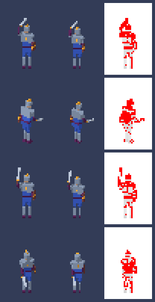

# Caching and batch generation

td2d keeps every intermediate result in `.td2d/cache`, keyed by a hash of what it depends on, so a rerun does only the work an edit made necessary. This page explains what is cached, what each kind of edit reruns, frame filters, batch runs, cancellation and cache maintenance.

## Two levels of cache

- **Stages.** Each stage's output is stored under the hash of its inputs and of the stages before it. An unchanged stage is reused whole; `td2d generate --dry-run` shows which stages would run.
- **Items.** Inside the render and pixel stages, every rendered sample and every processed sprite is cached on its own:
  - a **sample** is keyed by its posed geometry (a hash of every vertex in that pose), the scene (frame, scale, camera), its yaw, the materials, the lighting and the render backend;
  - a **sprite** is keyed by its sample and the pixel settings.

  So when the render stage has to run again, it renders only the samples whose key changed and copies the rest from the cache. Automatic palettes (`auto:<n>`) are built from every frame together, so their sprites are always processed as a set.

`td2d generate --json` reports both levels: `cache` counts stages reused and run, and `items` counts samples rendered and reused and sprites processed and reused.

## What an edit reruns

| Edit | Reruns |
|---|---|
| A material colour | render (every sample: materials are in the sample key) and later stages; the model and rig stay |
| One clip key | rig, plan, and only the samples whose pose changed (the frames between the keys around the edit), then pixel for those frames, and sheet onwards |
| Camera or lighting | plan or render and later stages; switching back finds the earlier samples in the item cache |
| Pixel settings | pixel and later stages; the render stage is reused whole |
| Sheet settings | sheet onwards (`td2d sheet <id>`) |
| Export settings | export only (`td2d export <id>`) |
| A file the asset does not use | nothing |

A fitted scale or ground margin (`pixelsPerUnit: "auto"`, `groundMargin: "auto"`) depends on every pose, so an edit that changes how far a clip reaches can change the fit and with it every sample. While iterating on animation, fix both at their fitted values (`td2d inspect <id>` shows them).

## Rendering only some frames

```sh
td2d generate characters/knight --frames walk/s/0-2      # render these, restore the rest from the cache
td2d generate characters/knight --clips attack --directions s,w
td2d render characters/knight --frames walk/s/0-2        # render only these and stop: a quick look
```

With `generate`, the filter says which samples may be rendered; every other sample must already be in the render cache, so the sheet is complete. If one is missing, the run fails with `E_PARTIAL_PLAN`: run once without the filter. With `render`, the filter makes a partial render that stops at the render stage.

## Batch runs

```sh
td2d batch --json                                   # every asset, two at a time
td2d batch --filter "props/*" --continue-on-error
td2d batch --manifest release.json --concurrency 4
td2d batch --resume build/batch-report.json
```

| Option | Meaning |
|---|---|
| `--filter <glob>` | Asset ids to include: `*` within a segment, `**` across segments. |
| `--manifest <file>` | A batch manifest (`td2d schema batch-manifest`): assets with per-asset `overrides`. |
| `--concurrency <n>` | Assets at once (default: cores minus one, at most 4). They share one browser, which renders one asset at a time, and one pool of worker threads for pixel processing and compositing. |
| `--continue-on-error` | Run every asset; exit 6 if any failed. |
| `--fail-fast` | Cancel assets already running when one fails. |
| `--resume <report>` | Skip assets that succeeded in an earlier report. |
| `--report <file>` | Where to write the report (default `build/batch-report.json`). |

Without `--continue-on-error`, a failure stops new assets from starting and the batch exits 4 (`E_BATCH_FAILED`); assets not run are marked `skipped` with the reason `stopped`. Each failure keeps its own error envelope in the [batch report](../reference/batch-report.md), and outputs of the assets that succeeded stay in place.

A manifest:

```json
{
  "schemaVersion": "1.0.0",
  "assets": [
    { "id": "characters/knight" },
    { "id": "characters/knight", "overrides": { "pixel": "pico-8" } }
  ],
  "options": { "concurrency": 2, "continueOnError": true }
}
```

Overrides are merged over the asset definition for this run only and checked like the asset itself.

## Cancelling and recovering

Ctrl-C (SIGINT) or SIGTERM cancels a run: rendering stops, the browser closes and worker threads stop, and td2d exits 130 within a few seconds. A batch writes its report first, with status `cancelled`, so `--resume` continues where it stopped. A second Ctrl-C exits at once.

Nothing half-written is left behind:

- stage outputs are written to `.td2d/tmp/<run id>/` and moved into the cache only when complete;
- a build's new files are staged in `build/<id>/.partial/` and moved into place at the end, and a leftover `.partial` is discarded by the next run;
- a rerun leaves a stage's directory in `build/<id>/` (renders, sprites, the models) in place only when every file in it still has the size and SHA-256 that `generation.json` lists; a file edited, removed or added by hand makes td2d copy the stage again from the cache;
- each run removes the temporary directories of earlier runs that are no longer running.

If the browser crashes, td2d restarts it once and renders the asset again, with the warning `W_BACKEND_RESTARTED`. A second crash fails the asset with `E_BACKEND_CRASHED`.

## Cache maintenance

```sh
td2d cache stats --json                 # entries and sizes by stage and item kind
td2d cache clean --older-than 1d        # remove entries not used for a day
td2d cache clean --max-size 2GB         # remove the least recently used until it fits
td2d cache clean --all
```

Reusing an entry marks it as used, so cleaning removes the least recently used entries first. After every run td2d keeps the cache under `cache.maxSize` from `td2d.project.json` (default `"5GB"`), warning with `W_CACHE_PRUNED` when it removes anything, and rewrites `.td2d/cache/index.json`, a list of every entry with its size and last use. Cleaning never touches `build/` or `history/`.

## Comparing generations

```sh
td2d compare characters/knight --json                  # against the previous history entry
td2d compare characters/knight --against <entry> --out diff.png
```

`compare` rebuilds every cell of both generations at frame size, whatever their layouts, and counts changed pixels per cell with pixelmatch. It reports cells added and removed, and `--out` writes an image with a row per changed cell: before, after and the difference.

After softening one key of the knight's attack clip, the four most changed cells:



Only the attack frames around the edited key rendered again; every other sample came from the cache.

## Performance

`pnpm bench` generates 20 animated characters, each in 8 directions with 3 clips of 6 frames (2880 samples), then reruns them unchanged and after a clip edit, and writes the results to `build/bench.json` (`BENCH_OUT` writes them elsewhere, `BENCH_CONCURRENCY` sets the concurrency). `node scripts/bench-check.ts` checks a result against the targets. The results on the development machine are in `docs/roadmaps/phase-8.md` and, after the Phase 11 profiling pass, `docs/roadmaps/phase-11.md`; CI runs the benchmark on Linux as a non-gating job, and a nightly workflow runs it and fails when a target is missed.
