# Camera, lighting and composition

Every direction of an asset is rendered with the same orthographic camera turned around the model. The model's origin is the pivot and lands on the same pixel in every frame. This page covers the camera presets, directions, scale and framing, lighting, and the composition checks. The pictures come from `examples/cameras`, which renders one cottage component in each configuration.

Every picture here can be regenerated:

```sh
cd examples/cameras
td2d generate camera/isometric lighting/world-sun
td2d preview camera/isometric --layout ring
td2d asset show camera/isometric --json   # the resolved camera settings
td2d inspect camera/isometric             # after generating: the ground margin and scale actually used
```

## Conventions

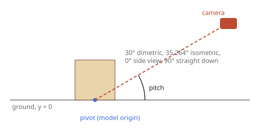

- **Units.** Metres, Y up, model front facing +Z. Put the base on y = 0.
- **Pitch** is the camera's angle above the horizon. At a yaw offset of 45 degrees a world edge projects with slope sin(pitch), so 30 degrees gives 2:1 pixel lines.
- **Pivot.** The model origin projects to the horizontal centre of the frame and to the line `groundMargin` pixels above the bottom edge. Both are pixel boundaries, so every final pixel covers exactly `supersample` x `supersample` render pixels and nothing shimmers between frames or directions.

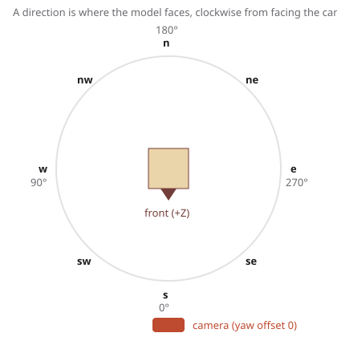

- **Directions** say which way the model faces: yaw is measured clockwise from facing the camera when seen from above. `s` is 0, `w` 90, `n` 180, `e` 270.
- **Yaw offset** turns the camera as well. The dimetric and isometric presets use 45 degrees, so `s` shows the model from its front-right corner.

## Camera presets

| Preset | View | Pitch | Yaw offset |
|---|---|---|---|
| `dimetric` (default) |  | 30 | 45 |
| `isometric` | 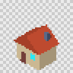 | 35.264 | 45 |
| `three-quarter` | 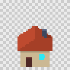 | 30 | 0 |
| `top-down-45` | 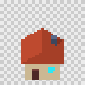 | 45 | 0 |
| `side` | 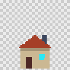 | 0 | 0 |
| `top` | 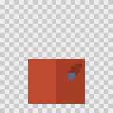 | 90 | 0 |

Use a preset by name, or override parts of it:

```json
{ "camera": { "preset": "dimetric", "yawOffset": 0, "groundMargin": 4 } }
```

Add your own as `presets/camera/<name>.json` (`td2d schema camera-preset`).

## Directions

| Value | Directions |
|---|---|
| `"d1"`, `"d1-side"` | `s`, or `e` for side-on assets |
| `"d4"` | `s w n e` |
| `"d8"` | `s sw w nw n ne e se` |
| `"d16"` | the 16-point compass |
| `["s", "w", "n", "e"]` | any compass names, in row order |
| `[{ "name": "front", "yaw": 0 }, ...]` | custom names and angles |
| `{ "count": 6, "start": 30 }` | evenly spaced, named `a30`, `a90`, `a150` and so on |

`td2d preview <id> --layout ring` shows the first frame of each direction placed at the angle it faces:

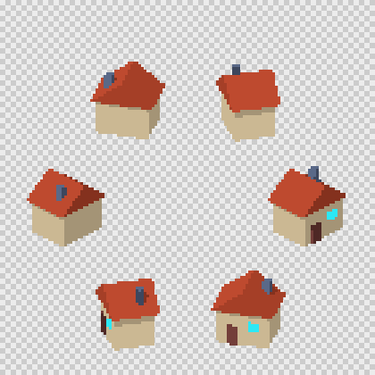

### Mirrored directions

```json
{ "directions": "d8", "mirror": ["e:w", "ne:nw", "se:sw"] }
```

Each `target:source` pair makes the target direction a horizontal flip of the source instead of a render. An 8-direction asset then renders 5 directions. The pivot is centred, so it stays put, and the manifest marks those cells `"mirrored": true`. Mirroring also flips the lighting and anything asymmetric, such as a door on one side:

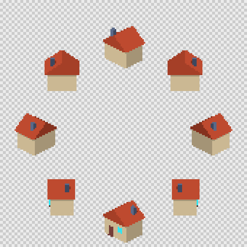

## Scale and framing

| Setting | Default | Meaning |
|---|---|---|
| `frame` | 32 x 32 (props), 32 x 48 (characters), 64 x 32 (tiles) | final cell size in pixels |
| `pixelsPerUnit` | 16 | pixels per metre; `"auto"` fits the model |
| `camera.groundMargin` | `"auto"` | pixels between the pivot line and the bottom edge |
| `render.supersample` | 4 | render scale before the pixel stage |

- `"groundMargin": "auto"` projects every vertex in every direction and picks the smallest margin that keeps the model one pixel above the bottom edge. Geometry in front of the pivot projects below it. A one-metre box at 16 pixels per metre needs 7 pixels.
- `"pixelsPerUnit": "auto"` picks the largest whole scale that keeps the model one pixel inside every edge in every direction. The chosen value is written to `manifest.json`, so you can copy it into the asset to pin it. The 24 x 24 cottage below was fitted this way: 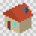

Use the same `pixelsPerUnit` for assets that must share a scale in game, such as all props of one set, and `"auto"` for icons and one-off sprites.

## Lighting presets

| Preset | Look | Lights |
|---|---|---|
| `studio-toon` (default) | 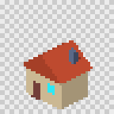 | key light from the upper left front (azimuth -35, elevation 55) with hard shadows, plus ambient fill; turns with the camera |
| `studio-rim` | 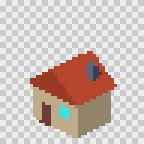 | studio-toon plus a warm rim light from behind |
| `world-sun` | 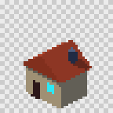 | a sun fixed in the world, with a sky and ground fill; the lit side changes with direction |
| `flat` | 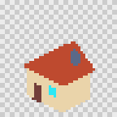 | full ambient only: exact material colours |

```json
{ "lighting": { "preset": "studio-toon", "lights": [ { "type": "directional", "azimuth": -60, "elevation": 40, "intensity": 1.7279, "castShadow": true }, { "type": "ambient", "intensity": 1.4137 } ] } }
```

- **Light types** are `directional` (with `azimuth`, `elevation`, `intensity`, `color` and `castShadow`), `ambient`, and `hemisphere` (with `skyColor` and `groundColor`).
- **Light space.** With `"space": "camera"`, azimuth is relative to the camera, so -35 is front-left in every direction. With `"space": "world"`, it is a fixed compass angle.
- **Intensity.** Light reaching a surface is intensity / π, as in three.js. Ambient π shows a material at exactly its colour. studio-toon uses 0.45π ambient (1.4137) plus 0.55π key (1.7279), so the brightest band is the material colour.
- **Toon bands.** A toon material's `bands` split the lit side of a surface into that many steps. Faces turned away from every light, and shadowed areas, get band 0, which is lit by ambient light only. With 3 bands a dimetric box shows three: top, left face and right face.
- **Shadows** are hard, from `BasicShadowMap`. Tune `shadows.bias` and `shadows.normalBias` if a model shows acne (speckles) or peter-panning (shadows detached from their base).

### Ground shadow

```json
{ "lighting": { "preset": "studio-toon", "groundShadow": { "enabled": true, "color": "#3a4466" } } }
```

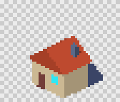

The model's shadow on the ground is drawn into the sprite in one solid colour. Sprite alpha is binary, so a semi-transparent shadow would either vanish or turn solid. The shadow falls away from the key light, so give the frame room on that side. `td2d` warns with `W_COMPOSITION_EDGE` if the shadow reaches the edge. Many games draw shadows separately instead; leave it off for those.

## Composition checks

| Warning | Meaning | Fix |
|---|---|---|
| `W_MODEL_OUT_OF_FRAME` | the model leaves the frame in some direction (measured before rendering) | lower `pixelsPerUnit` or use `"auto"`, or enlarge `frame` |
| `W_COMPOSITION_EDGE` | a sprite touches the frame edge | as above |
| `W_COMPOSITION_GROUND` | a sprite does not reach the ground line, so the model floats above its pivot | move the model's base to y = 0 |

All three are warnings, so `generate` exits 0. `--strict` makes them fail with exit 5.

## What reruns when you change something

| Change | Reruns |
|---|---|
| camera, directions, mirror, frame, `pixelsPerUnit` | plan and everything after it; geometry is reused |
| lighting, materials | render and everything after it |
| geometry | everything |
