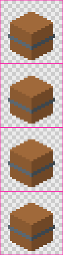

# CI and release

## Generating sprites in CI

td2d is deterministic: the same inputs give the same pixels on any machine with the same td2d and browser build, so CI can regenerate sprites and fail when they change unexpectedly, or when they fail validation.

```yaml
# .github/workflows/sprites.yml in a game repository (proposed shape)
jobs:
  sprites:
    runs-on: ubuntu-24.04
    steps:
      - uses: actions/checkout@v4
      - uses: actions/setup-node@v4
        with: { node-version: 24 }
      - run: npm ci
      - run: npx td2d doctor --fix
      - run: npx playwright install-deps chromium
      - run: npx td2d batch --strict --json > batch.json
      - uses: actions/upload-artifact@v4
        if: always()
        with: { name: sprites, path: build/ }
```

Run the same check locally first:

```sh
td2d batch --strict --json > batch.json; echo "exit $?"
td2d batch --resume build/batch-report.json   # after fixing what failed
```

- `--strict` fails the job on validation warnings as well as errors (exit 5).
- `build/batch-report.json` says which assets failed and why; `td2d batch --resume` reruns only those.
- Cache `.td2d/cache` between runs (keyed on the td2d version) to rerender only what changed.
- `td2d index` turns `build/` into a static viewer you can publish as a CI artefact or page.



## td2d's own CI

`.github/workflows/ci.yml` runs on every push and pull request:

| Job | Runs |
|---|---|
| Linux (full suite) | Lint, build, a check that `pnpm generate` leaves `schemas/` and `docs/reference/` unchanged, then every test project: unit, render, harness, viewer and end-to-end |
| macOS (build and end-to-end) | Build, then the render and end-to-end tests |
| Pack and install (Linux, macOS, Windows) | `pnpm pack:smoke`: packs every package, installs the tarballs with npm into an empty directory and runs doctor, init, generate, preview, validate and index from there, then installs them with `npm install -g` into a temporary prefix and runs doctor, generate, compare, batch, asset emit and the viewer through the installed `td2d` command, and last runs doctor, init and generate through `npx` with the tarballs as its packages |
| headless-gl parity (Linux, xvfb) | The optional headless-gl backend against the render goldens |
| Benchmark (non-gating) | `pnpm bench`, uploaded as an artefact for trends |

Render tests compare against golden images that are byte-identical on Linux arm64 and x86_64, and on macOS. After an intended change to rendering, `pnpm test:update-goldens` rewrites them; review the diff images in `packages/core/.artifacts/` first.

## Releasing

Packages are versioned together with changesets: `@td2d/schema`, `@td2d/core`, `@td2d/render-harness`, `@td2d/viewer` and `@td2d/cli` always share one version. Every change adds a changeset (`pnpm changeset`) describing what users see.

`.github/workflows/release.yml` does the rest:

1. On every push to `main` it checks the packages (`pnpm run release:check`), builds, runs the full suite and the pack-and-install smoke test, then opens or updates a "Version packages" pull request that applies the pending changesets (versions and per-package `CHANGELOG.md` files).
2. Merging that pull request runs it again and publishes every package to npm.
3. Run it by hand (`workflow_dispatch`) to publish a snapshot prerelease, `0.0.0-next-<timestamp>`, under the `next` dist-tag.

Publishing uses npm trusted publishing: the workflow's OIDC identity is the credential, so no npm token is stored, and every package carries a provenance statement linking it to the workflow run.

Publishing depends on two settings:

1. On npmjs.com, each of the five packages gets this repository and `release.yml` as its trusted publisher.
2. Each package's `package.json` has a `repository` naming this GitHub repository, such as `"repository": { "type": "git", "url": "git+https://github.com/brphillis/threedee-twodee.git", "directory": "packages/cli" }`. npm rejects a provenance publish whose `repository.url` names a different repository, so a fork that publishes must change it.

`pnpm run release:check` checks the packages before anything is published: one shared version, the `@td2d` scope, MIT with a `LICENSE` file, a `files` list and a README in every package and, inside GitHub Actions, a `repository.url` that names the repository the workflow runs in. It prints the `repository` entry to add when one is missing.

Check what would be published without publishing:

```sh
pnpm run release:check                           # package metadata
pnpm build
pnpm pack:smoke                                  # pack, install and run, in a temporary directory
pnpm -r publish --dry-run --no-git-checks        # what npm would receive
```

## Version policy

td2d follows semantic versioning, applied to everything a user or an agent relies on:

| Surface | A breaking change is | Handled by |
|---|---|---|
| The CLI | Removing or renaming a command or option, changing an exit code, or changing the meaning of an envelope field | A major version |
| The `--json` envelope and command `data` | Removing or renaming a field, or changing its type. Adding fields is not breaking | A major version |
| Error and warning codes | Removing or renaming a code. New codes are not breaking | A major version |
| Input documents (`asset.json`, presets, palettes, the project file) | A definition that was valid becoming invalid, or meaning something else | A new major `schemaVersion` (`2.0.0`) with a migration note; td2d keeps reading every `1.x.y` |
| Output documents (manifest, validation report, generation record, batch report) | Removing or renaming a field | A new major output `schemaVersion`; readers should accept any `1.x` |
| Pixels | The same input giving different sprites | A minor version at most, with the changeset saying so; stage versions in the cache keys make old cache entries miss |
| The TypeScript API (`@td2d/core`, `@td2d/schema`) | Removing or changing an exported function or type | A major version once 1.0 is out; before 1.0, a minor version |

Deprecated commands, options and fields keep working for at least one minor version and produce a warning that names the replacement.
