# Example gallery

<!-- Generated by `pnpm generate` from examples/. Do not edit by hand. -->

Every project under `examples/` is a real td2d project with its outputs committed in `expected/`; the test suite regenerates each one and compares every exported file byte for byte. The previews below are written by `pnpm docs:images`, also checked by the test suite.

## starter

The project `td2d init` creates: one crate from four directions. [README](../../examples/starter/README.md)

```sh
cd examples/starter
td2d generate
```

| Asset | Preview |
|---|---|
| `props/crate`<br>Wooden supply crate with an iron band. | 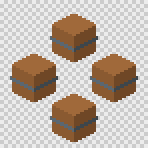 |

## props

Eight props, each built a different way: lathe, CSG, components, mirrored groups, wedges, extrusions, an imported GLB and palette colours. [README](../../examples/props/README.md)

```sh
cd examples/props
td2d generate
```

| Asset | Preview |
|---|---|
| `props/barrel`<br>A lathed barrel with two iron hoops, generated by scripts/barrel.ts. | 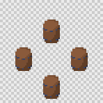 |
| `props/crate-notched`<br>A crate with a hand-hole bored through and one corner cut away, made with CSG. | 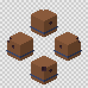 |
| `props/fence`<br>Four fence-post components in a row, joined by two repeated rails. | 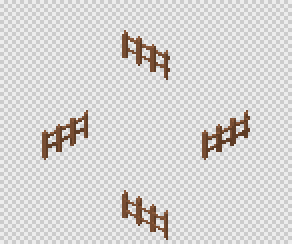 |
| `props/lamp`<br>A street lamp: one arm and lantern, mirrored to the other side. | 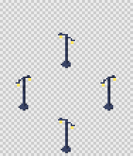 |
| `props/ramp`<br>A wedge ramp leading up to a box platform. | 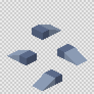 |
| `props/sword`<br>Extruded blade with a box guard, cylinder grip and sphere pommel. | 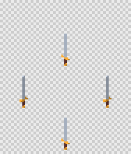 |
| `props/teapot`<br>A GLB made elsewhere, imported with a unit scale and a material map, standing on a primitive plate. | 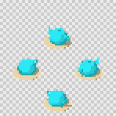 |
| `props/totem`<br>A capsule body with repeated torus rings and a cone top, coloured per part from a palette. | 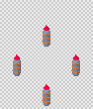 |

## cameras

One cottage with every camera and lighting preset, plus automatic scale, counted and mirrored directions. [README](../../examples/cameras/README.md)

```sh
cd examples/cameras
td2d generate
```

| Asset | Preview |
|---|---|
| `camera/dimetric`<br>The default 2:1 pixel isometric camera. |  |
| `camera/isometric`<br>True isometric: 35.264 degree pitch, 30 degree lines. | 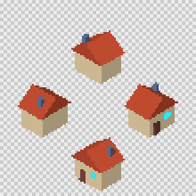 |
| `camera/side`<br>Side-scroller view. | 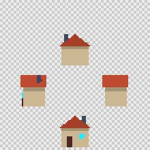 |
| `camera/three-quarter`<br>Classic top-down RPG view, no yaw offset. | 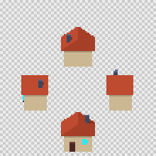 |
| `camera/top`<br>Straight down, for maps. | 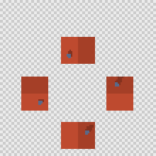 |
| `camera/top-down-45`<br>A steeper top-down view. | 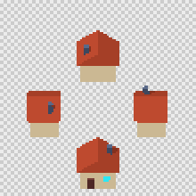 |
| `composition/auto-fit`<br>pixelsPerUnit auto: the largest whole scale that fits a 24 x 24 frame. | 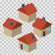 |
| `composition/counted`<br>Six evenly spaced directions starting at 30 degrees. | 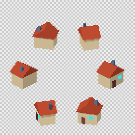 |
| `composition/mirrored`<br>Eight directions where the east side is mirrored from the west, so only five are rendered. | 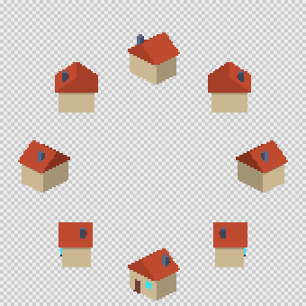 |
| `lighting/flat`<br>Ambient light only: exact material colours. | 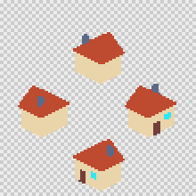 |
| `lighting/ground-shadow`<br>studio-toon with the ground shadow drawn in. | 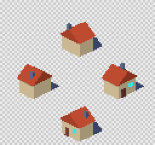 |
| `lighting/studio-rim`<br>studio-toon plus a warm rim light from behind. |  |
| `lighting/studio-toon`<br>Key light from the upper left front and ambient fill, turning with the camera. | 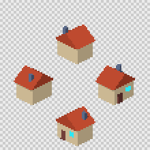 |
| `lighting/world-sun`<br>A sun fixed in the world: the lit side changes with direction. | 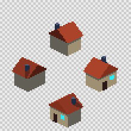 |

## pixel

One mushroom processed with each pixel setting: downscale, palettes, dithering, posterising, outlines and presets. [README](../../examples/pixel/README.md)

```sh
cd examples/pixel
td2d generate
```

| Asset | Preview |
|---|---|
| `dither/bayer-2-50`<br>PICO-8 palette with a 2 x 2 ordered dither at strength 0.5. | 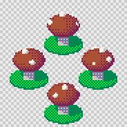 |
| `dither/bayer-4-35`<br>PICO-8 palette with a 4 x 4 ordered dither at strength 0.35. | 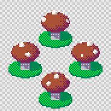 |
| `dither/bayer-4-70`<br>PICO-8 palette with a 4 x 4 ordered dither at strength 0.7. | 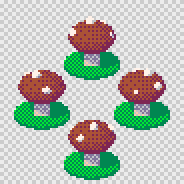 |
| `dither/none`<br>PICO-8 palette without dithering: gradients become flat bands. |  |
| `downscale/box`<br>Box filter: each pixel averages its 4 x 4 block, which smooths shading but makes in-between colours. | 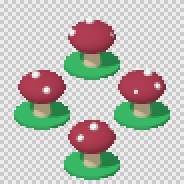 |
| `downscale/mode`<br>The default: each pixel takes the most common colour of its 4 x 4 block, so only rendered colours appear. |  |
| `outline/inside`<br>The silhouette's own edge pixels recoloured, so the sprite does not grow. | 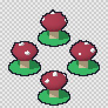 |
| `outline/outside`<br>A dark one-pixel ring around the silhouette, diagonals included. | 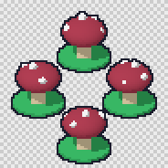 |
| `outline/outside-4`<br>The same ring drawn with 4-connectivity, which leaves the corners open. | 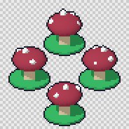 |
| `outline/snapped`<br>PICO-8 palette with the outline colour snapped to its nearest palette colour. | 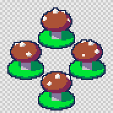 |
| `palette/auto-16`<br>A 16-colour palette built from all the asset's frames, shared by every frame. | 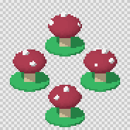 |
| `palette/auto-4`<br>Four colours built from the asset itself. |  |
| `palette/custom`<br>The project palette palettes/toadstool-7.json, seven hand-picked colours. | 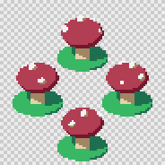 |
| `palette/endesga-32`<br>Snapped to the built-in Endesga 32 palette in Oklab space. | 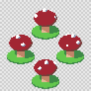 |
| `palette/none`<br>No palette: the rendered colours, here dozens of lambert gradient steps. |  |
| `posterize/4`<br>Each colour channel cut to 4 levels before anything else. | 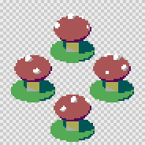 |
| `preset/pico-8`<br>The built-in pico-8 preset. | 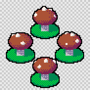 |
| `preset/retro-16`<br>The built-in retro-16 preset: auto:16 palette, outline and stray-pixel cleanup. | 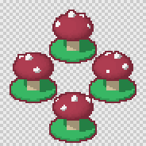 |

## characters

A rigged knight with idle, walk and attack clips in eight directions, on a grid sheet and on a packed sheet in every export format. [README](../../examples/characters/README.md)

```sh
cd examples/characters
td2d generate
```

| Asset | Preview |
|---|---|
| `characters/knight`<br>A knight with a sword in the right hand and a shield on the left arm. Every part rides one bone; the left limbs are mirrored to the right. |  |
| `characters/knight-packed`<br>The same knight, trimmed and packed onto power-of-two sheets, exported in every format: Aseprite, PixiJS, Phaser, Godot, frame PNGs and GIF previews. | 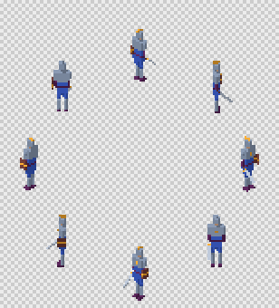 |

## engines

Phaser and PixiJS pages that load the knight's exports and play a clip; a browser test runs them. [README](../../examples/engines/README.md)

```sh
node examples/engines/serve.ts examples/characters/build/characters/knight/sheets 8080
```


