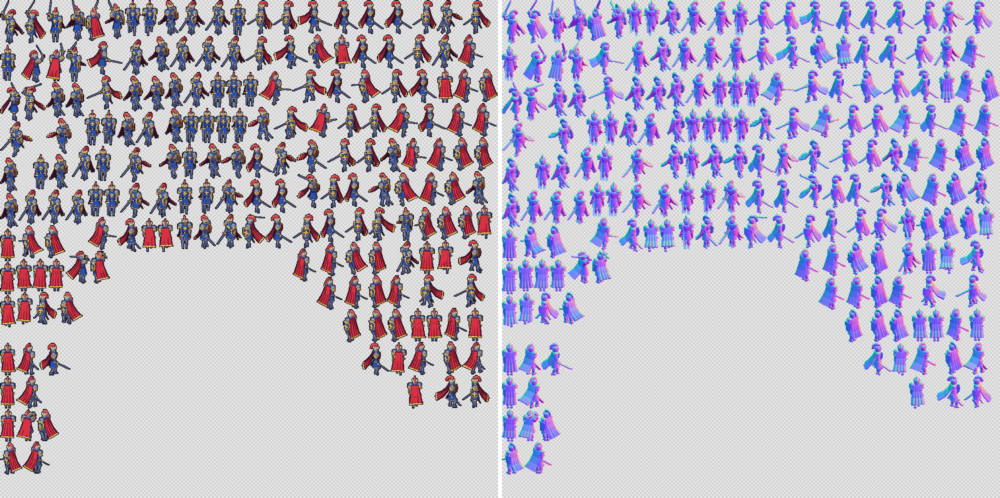

# Getting sprites into an engine

td2d writes each asset's sheets plus data files for the engines you name. This guide picks the format for your engine and shows a runnable example; the [export format reference](../reference/export-formats.md) documents every field.

## Pick a format

| Engine or tool | Format | Load it with |
|---|---|---|
| Aseprite, or any loader that reads its JSON | `aseprite-json` | File, Import Sprite Sheet; or your engine's Aseprite loader |
| Phaser 3 and 4 | `aseprite-json` (simplest) or `phaser-atlas` (multi-page, with animations) | `this.load.aseprite` and `this.anims.createFromAseprite`, or `this.load.multiatlas` |
| PixiJS 8 | `pixi` | `PIXI.Assets.load` and `AnimatedSprite` |
| Godot 4 | `godot-spriteframes` | Drop the `.tres` and sheets into the project; assign it to an `AnimatedSprite2D` |
| Anything else | `frames` | One PNG per frame, named `<asset>_<clip>_<direction>_<nnn>.png` |
| Previews for people | `gif-preview` | One animated GIF per clip |

Every format names sequences `<clip>_<direction>` (such as `walk_s`) and carries the frame durations from the clip's fps. The pivot, where the character stands, is in `manifest.json` (`pivot.normalized`) and in each format that has a place for it.

## Example: the packed knight in every format

`examples/characters` has a knight packed onto power-of-two sheets and exported with the `everything` preset:

```sh
cd examples/characters
td2d generate characters/knight-packed
ls build/characters/knight-packed/sheets
```

```text
frames/                    knight-packed.json         knight-packed.pixi.json
knight-packed-attack.gif   knight-packed.phaser.json  knight-packed.png
knight-packed-idle.gif     knight-packed-walk.gif     knight-packed.tres
manifest.json
```

The knight fits on one page; a larger asset gets `knight-packed-0.png`, `-1.png` and so on, each with its own Aseprite and PixiJS data, and one Phaser multi-atlas and Godot resource for all pages.

The walk GIF, as `gif-preview` writes it:


To add formats to an asset without regenerating anything else:

```sh
td2d export characters/knight --format aseprite-json,pixi,phaser-atlas
```

Only the export stage runs; sprites and sheets come from the cache.

## Normal maps for lit sprites

Because every sprite comes from a 3D model, td2d can write the normal map a hand artist cannot: set `render.normals` and each sheet gets a `<sheet>-normals.png` beside it, the same size and layout, so a cell's normals sit at the cell's own rectangle. Each pixel's RGB is the surface normal in view space, x to the right, y up and z towards the viewer, mapped from -1..1 to 0..255; the alpha matches the sprite's, outline pixels take the normal next to them, and mirrored directions have their x turned around.

```json
{ "render": { "normals": true } }
```

The packed knight's sheet and its normal map:



| Engine | Loading the normal map |
|---|---|
| Phaser 3 and 4 | Pass both images: `this.load.multiatlas` and `this.load.atlas` take `[image, normalMap]` as the texture URL; with Light2D (`sprite.setPipeline('Light2D')`) the normals light the sprite. For `aseprite-json`, `this.load.aseprite(key, [image, normalMap], json)` does the same. |
| Godot 4 | Make a `CanvasTexture` with the sheet as `diffuse_texture` and the normal map as `normal_texture`, then use it in place of the sheet; `PointLight2D` lights it. |
| PixiJS 8 | Use a lighting plugin such as `pixi-lights`, which takes a diffuse and a normal texture per sprite. |

The manifest lists each sheet's normal map under `sheets[].normals` and the files under `files.normals`.

## Play it in a browser engine

`examples/engines` has a Phaser page and a PixiJS page that play any clip of a generated sheet:

```sh
node examples/engines/serve.ts examples/characters/build/characters/knight/sheets 8080
# http://127.0.0.1:8080/phaser.html?clip=walk_s
# http://127.0.0.1:8080/pixi.html?clip=walk_s
```

An end-to-end test (`packages/cli/e2e/engines.test.ts`) loads both pages in Chromium and checks the walk cycle plays, on a grid sheet and on a trimmed, packed one. `scripts/godot/check.sh` loads the Godot export in a real Godot 4 to check it opens.

## Trimmed and packed sheets

With `"sheet": "packed"`, cells are trimmed to their opaque pixels and packed tightly. Every format records each cell's offset inside the frame, so engines draw trimmed frames in the right place; `td2d inspect <id> --cells` lists them. Keep the pivot from the manifest: it refers to the untrimmed frame. The [sprite sheet guide](sprite-sheets.md) covers layouts, page splitting and padding.
