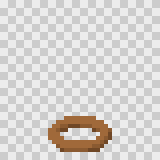

# Extending td2d

td2d grows by registries: part types, pixel passes, exporters and render backends are each a table of entries with a schema, a version and an implementation. Adding one means adding an entry, its schema and its tests; the CLI, `td2d describe`, the generated schemas and the cache keys pick it up from the registry.

Work in this repository:

```sh
pnpm install && pnpm build
pnpm test:unit           # quick, against the TypeScript sources
pnpm test                # everything, including rendering and the browser tests
pnpm generate            # after any schema change: schemas/, docs/reference/
pnpm docs:images         # after any change to how things look
```

`pnpm install` also tries to build `gl` for the optional headless-gl backend. It is an optional dependency of the workspace: where it cannot be built (no prebuilt binary and no C++ toolchain), the install goes on without it and the headless-gl tests report that it cannot run here instead of failing. On Linux, run them under `xvfb-run`.

Every version number below feeds a cache key. Bump it whenever the same input would give a different output, so old cache entries stop matching.

## A part type



1. **Schema** in `packages/schema/src/documents/model.ts`: a `z.strictObject` with `type: z.literal('<name>')`, the shared base fields, and `.meta({ description, examples: [...] })`. The first example is drawn for the guide and built by a test, so make it representative. Add it to the `Part` union and to `PART_SCHEMAS`.
2. **Builder** in `packages/core/src/model/parts.ts`: an entry in `BUILDERS` that returns a three.js `BufferGeometry` centred on the origin, in metres, with Y up. Placement, rotation, mirroring and materials are applied for you.
3. **Tests**: `packages/core/test/model.test.ts` builds every registered type and checks it is closed where it should be; add cases for the new options. A unit test fails if a type in `PART_SCHEMAS` has no builder.
4. `pnpm generate`, then `pnpm docs:images` writes `docs/guide/images/models/<name>.png`; add a section to [Building models](models.md).

## A pixel pass

Passes run in the order of `PIXEL_PASSES` in `packages/schema/src/documents/pixel.ts` (or the order a pixel setting's `passes` gives) over every frame at once, so a pass can look across frames as the palette pass does.

1. Add the pass id to `PIXEL_PASSES` and its settings to `PixelOverrides` and `PixelSettings`, with descriptions and defaults in `packages/core/src/project/defaults.ts`.
2. Implement it in `PIXEL_PASS_REGISTRY` in `packages/core/src/pixel/pipeline.ts`: `enabled(settings)` says whether the settings ask for it, and `run(images, ctx)` returns new images. Give it a `version` and a one-line `description` (shown by `td2d describe`).
3. Keep it free of `sharp` and the DOM: passes run in worker threads, and a test fails if the worker's imports reach `sharp`.
4. Unit-test it on small hand-made images in `packages/core/test/pixel.test.ts`, then add a picture to the [pixel art guide](pixel-art.md) through `scripts/docs-images.ts`.

## An exporter

1. Add the format id to `ExportFormat` in `packages/schema/src/documents/export.ts`, and its options to `ExportOverrides` if it has any.
2. If it writes JSON, give that JSON a zod schema in `packages/schema/src/documents/engines.ts` and register it in `packages/schema/src/registry.ts`, so `td2d schema <name>` prints it and `schemas/` carries it.
3. Implement an `Exporter` in `packages/core/src/export/`: `write(ctx)` writes into `ctx.dir` and returns the file names. Write JSON with `writeChecked`, which validates it against the schema first. `ctx.sprites()` decodes sprites only if you ask for them.
4. Register it in `EXPORTERS` in `packages/core/src/pipeline/stages.ts`. Its `version` is part of the export stage's cache key.
5. Test it with a golden file in `packages/core/test/sheet.test.ts`, and, if an engine reads it, with a page under `examples/engines` and a case in `packages/cli/e2e/engines.test.ts`. Document it in the [export format reference](../reference/export-formats.md).

## A render backend

A backend turns a `RenderJob` (a GLB, scene settings and samples) into RGBA frames.

1. Implement `BackendDescriptor` and `RenderBackend` from `packages/core/src/render/backend.ts`: `start`, `render(job, sink)`, `stop`. `fingerprint()` returns everything outside the job that can change pixels, such as library versions; it is part of every render cache key.
2. Register it in `BACKENDS` in `packages/core/src/render/registry.ts`, and add a check to `td2d doctor` that says whether it can run here.
3. Reuse the scene code in `@td2d/render-harness` (`HarnessScene`), which has no DOM dependency, so a new backend draws exactly what the browser does.
4. Prove parity: render the golden scenes in `packages/core/test/render/` with both backends and compare.

`packages/core/src/render/headless-gl.ts` is a complete second backend to copy from: it loads an optional dependency lazily, reports why it cannot run (for `td2d doctor`), fingerprints the `gl` version and the harness, and `packages/core/test/render/headless-gl.test.ts` compares it with the default backend on every golden scene.

## Conventions

- TypeScript with `strict`, no `any`; Biome formats and lints (`pnpm lint`).
- Every input is validated by a zod schema with descriptions; unknown keys are errors.
- Errors are `Td2dError` with a code from the catalogue in `packages/schema/src/errors.ts`. A new code needs a summary, detail, hint and troubleshooting topic, and a line in [Troubleshooting](troubleshooting.md); tests check all of these.
- Each change gets a changeset (`pnpm changeset`).
