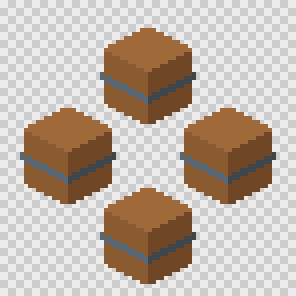

# Generating sprites

`td2d generate` turns an asset definition into a validated sprite sheet. It runs eight stages, caches each one by content, and writes everything to `build/<id>/`.

```sh
td2d generate props/crate
td2d preview props/crate          # enlarged PNG with cell borders
td2d viewer --open                # browse the build in a web page
```

## Stages

| Stage | Produces | Reruns when you change |
|---|---|---|
| `resolve` | `resolved.json`: the asset after defaults and presets | anything in the definition or presets |
| `model` | `model/model.glb` and `model/model-report.json` | parts, components they use, or imported files |
| `plan` | `plan.json`: samples, sheet rows, fitted ground margin | camera, frame, pixels per unit, supersample, directions, clips, or the model |
| `render` | `renders/<clip>/<dir>/<nnn>.png` at frame size times supersample | material colours and shading, lighting, the renderer, or the plan |
| `pixel` | `sprites/<clip>/<dir>/<nnn>.png` at frame size | pixel settings, or the renders |
| `sheet` | the sheet image (kept in the cache) | sheet settings, or the sprites |
| `validate` | `validation.json` | acceptance settings, or the sprites and sheet |
| `export` | `sheets/<name>.png`, `sheets/<name>.json` (Aseprite), `sheets/manifest.json` | export settings, or anything upstream |

Colours are applied at render time, so recolouring an asset reuses its geometry and plan. Stage results live in `.td2d/cache/<stage>/`. Each is keyed by a hash of the stage's inputs, the hashes of the stages it depends on, and the td2d version.

## Options

| Option | Effect |
|---|---|
| `--dry-run` | List which stages would run and which would be reused. Nothing runs. |
| `--force` | Recompute every stage. |
| `--from <stage>` | Recompute this stage and every later one. |
| `--to <stage>` | Stop after this stage. Later outputs from an earlier run are kept if still valid and removed if stale. |
| `--no-cache` | Neither read nor write the cache. |
| `--strict` | Treat validation warnings as failures. |

`td2d model build <id>` is `generate --to model`, and `td2d render <id>` is `generate --to render`.

## Outputs

```text
build/props/crate/
  resolved.json         the asset as generated
  model/model.glb       geometry, materials named but uncoloured
  plan.json             samples, rows, ground margin
  renders/idle/s/000.png
  sprites/idle/s/000.png
  validation.json
  generation.json       stages, cache use, renderer, every output with its sha256
  sheets/
    crate.png           the sprite sheet
    crate.json          Aseprite JSON Hash (Phaser, PixiJS and Godot importers read it)
    manifest.json       td2d's own description: cells, pivot, camera, clips, validation
```

Sheets use a grid: one row per clip and direction, one column per frame. The pivot is the model origin, at the horizontal centre of each cell and `camera.groundMargin` pixels above its bottom edge.

## Ground margin

`camera.groundMargin` defaults to `"auto"`. Geometry in front of the pivot projects below the pivot line, so td2d projects every vertex in every direction. It then picks the smallest margin that keeps the whole model at least one pixel above the bottom edge. The same margin is used for every direction, so the pivot never moves. The fitted value is in `manifest.json` as `camera.groundMargin`. Set a number to pin it.

## Validation

| Check | Fails or warns when |
|---|---|
| `sprite-size` | a sprite is not the frame size (fail) |
| `binary-alpha` | a pixel is partly transparent (fail) |
| `not-blank` | a sprite is under 0.5 percent opaque (fail) |
| `inside-frame` | a sprite touches the frame edge (warn) |
| `grounded` | a sprite floats above the ground line (warn, not for effects) |
| `coverage` | a sprite is outside `acceptance.minAlphaCoverage` to `maxAlphaCoverage` (fail) |
| `max-colors` | a sprite uses more than `acceptance.maxColors` colours (fail) |
| `sheet-size` | the sheet does not match its layout (fail) |

A failed check makes `generate` exit with code 5 and error `E_VALIDATION_FAILED`, but every output is still written so you can look at it. Warnings keep exit code 0 unless `--strict` is set.

## Looking at results

- `td2d inspect <id>` summarises the sheet, cells, pivot, clips and validation. `--frame idle/s/000` reports one sprite's size, coverage, bounds and colours.
- `td2d preview <id>` writes `build/<id>/preview.png`, the sheet scaled by 8 on a checkerboard with cell borders. `--out file.png`, `--scale`, `--background` and `--no-grid` adjust it.
- `td2d viewer` serves a read-only web page for the build: library, sheet, animation, metadata, validation, history, compare and a 3D view, updated live. See [The web viewer](viewer.md).
- `td2d history list <id>` lists earlier generations. A new entry is recorded in `history/<id>/` whenever the exported outputs change.

`td2d preview props/crate --layout ring` places one frame of each direction at the angle it faces:



## More settings

- [Pixel art processing](pixel-art.md): palettes, dithering, outlines and cleanup.
- [Rigging and animation](rigging-and-animation.md): rigs, clips and generators.
- [Sprite sheets](sprite-sheets.md): layouts, trimming, splitting, and the [export formats](../reference/export-formats.md) for engines.
