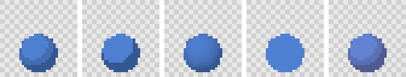

# Materials and palettes

Each part names a material. A material says what colour the part is and how light falls on it; a palette says which colours the finished sprites may use.

## Materials

```json
{
  "materials": {
    "paint": { "color": "#4f7fd0", "shading": "toon", "bands": 3 },
    "trim": { "color": { "palette": "pico-8", "index": 9 }, "shading": "flat" },
    "glow": { "color": "#4f7fd0", "emissive": "#3a1a00" }
  }
}
```

| Field | Meaning |
|---|---|
| `color` | `#rrggbb`, or `{ "palette": <name>, "index": <n> }` to take a colour from a palette |
| `shading` | `toon` (banded, the default), `lambert` (smooth) or `flat` (unlit) |
| `bands` | Light bands for toon shading, 2 to 8. Default 3 |
| `emissive` | A colour added regardless of light |
| `outline` | Whether `render.lines` may line this material. Default true. Turn it off for fine detail and dark gaps |
| `opacity` | Below 1 gives `W_OPACITY_THRESHOLDED`: sprites have binary alpha, so prefer dithering |

The same sphere with toon shading in 3 and 2 bands, lambert, flat, and toon with an emissive colour:



Toon shading suits pixel art: each band becomes a flat area of one colour, so sprites keep few colours and read clearly at small sizes. Lambert gives smooth gradients, which the palette pass then quantises. Flat ignores lights entirely, for emblems and effects.

Put shared materials in the project's `defaults.materials`; an asset's own materials merge over them. A part can override its material's colour with `color` for one part only. `td2d validate` warns with `W_UNUSED_MATERIAL` about materials no part uses.

## Palettes

`pixel.palette` restricts every sprite to a palette:

```json
{ "pixel": { "palette": "fixed:endesga-32", "dither": "bayer-4", "ditherStrength": 0.35 } }
```

| Value | Meaning |
|---|---|
| `none` | No palette: keep the rendered colours (the default) |
| `fixed:<name>` | A built-in palette (`endesga-32`, `pico-8`, `db32`, `resurrect-64`, `aap-64`) or one in `palettes/` |
| `auto:<n>` | Build an `n`-colour palette (2 to 256) from the asset's own frames |

| `none` | `fixed:endesga-32` | `auto:16` | `auto:4` | `fixed:crate-8` |
|---|---|---|---|---|
|  |  |  |  |  |

Colours are matched in the Oklab colour space, which follows how different colours look rather than how far apart their RGB numbers are. With a fixed palette the `palette` check fails if any sprite uses a colour outside it, and `pixel.outline.snapToPalette` keeps outlines inside it too.

A project palette is a JSON file in `palettes/`:

```json
{
  "schemaVersion": "1.0.0",
  "name": "crate-8",
  "description": "A hand-picked eight-colour palette for the crates.",
  "colors": ["#3a2214", "#6e4422", "#a06232", "#d08c48", "#e8b070", "#9a7650", "#c49a68", "#c8924e"]
}
```

`examples/pixel` uses this one (`palette/custom`); `td2d schema palette` shows the format. The [pixel art guide](pixel-art.md) covers dithering, posterising, outlines and cleanup, which work together with the palette.

## Checking colours

```sh
td2d inspect props/crate --frame idle/s/000 --json   # colours of one sprite
td2d viewer                                           # metadata tab: every colour used, with counts
```

`acceptance.maxColors` in an asset makes validation fail when any sprite uses more colours than allowed.
