# Building models

An asset's `model.parts` is a list of parts. Most parts are shapes with a material. Groups, CSG, components and imports combine or bring in other geometry. Every part accepts the same transform fields and modifiers. `td2d schema asset` has the full schema, and `td2d describe --json` lists each part type with an example.

The pictures on this page are rendered by `scripts/docs-images.ts` from the schema examples, with the default `dimetric` camera.

## Shared fields

| Field | Meaning |
|---|---|
| `id` | Unique within the asset. Components and copies get derived ids such as `gate-post` or `rail-1`. |
| `position` | Where the pivot goes, in metres in the parent frame. |
| `rotation` | Degrees about the pivot, applied X, then Y, then Z. |
| `scale` | A number or `[x, y, z]`. Negative values mirror. |
| `pivot` | The point in the part's own frame that rotation and scale act around. Default `[0, 0, 0]`, the part centre. |
| `visible` | `false` drops the part. |
| `repeat` | `{ "count": 4, "offset": [0.6, 0, 0], "rotation": [0, 0, 0] }` makes copies; copy *i* moves by *i* x offset and turns by *i* x rotation about the parent origin. |
| `mirror` | `"x"`, `"y"`, `"z"` or a list: adds a copy mirrored across that plane of the parent frame. |
| `material` | Shapes only: a material from the asset, the project `defaults.materials`, or a component. |
| `color` | Shapes only: a colour for this part alone, as `#rrggbb` or `{ "palette": "pico-8", "index": 8 }`. It keeps the material's shading. |

Units are metres, Y is up and the model front faces +Z. Put the base of the model on y = 0: the ground line, shadows and the automatic ground margin all assume it. td2d warns with `W_MODEL_BELOW_GROUND` when geometry goes below 0.

## Shapes

| Type | Picture | Fields |
|---|---|---|
| `box` | 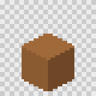 | `size: [w, h, d]` |
| `cylinder` | 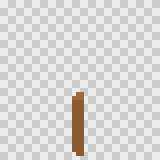 | `radius` (or `radiusTop` and `radiusBottom`), `height`, `segments` |
| `cone` | 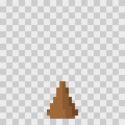 | `radius`, `height`, `segments`; tip up |
| `sphere` | 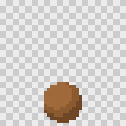 | `radius`, `widthSegments`, `heightSegments` |
| `capsule` | 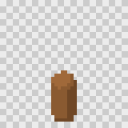 | `radius`, `length` of the straight middle, `capSegments`, `radialSegments` |
| `torus` |  | `radius` to the tube centre, `tube`; lies flat in XZ |
| `plane` | 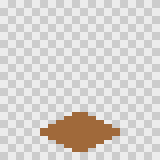 | `size: [w, d]`; flat, facing up, one-sided |
| `wedge` | 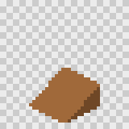 | `size: [w, h, d]`; full height at the back (-Z), zero at the front |
| `lathe` | 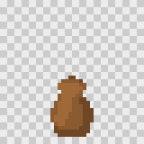 | `profile: [[radius, height], ...]` bottom to top, spun around Y; `segments` |
| `extrude` | 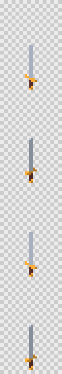 | `shape: [[x, y], ...]` in XY, optional `holes`, `depth` along Z (centred) |

Every shape except `plane` is closed, so it can be used in CSG. Lathes are closed when the profile starts and ends at radius 0. Segment counts change the look a lot at sprite sizes: 6 to 16 segments often reads better than a smooth 64.

## Groups

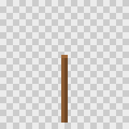

```json
{ "type": "group", "id": "lamp", "position": [0, 0, 0], "parts": [{ "type": "cylinder", "id": "pole", "material": "iron", "radius": 0.05, "height": 1.5, "position": [0, 0.75, 0] }] }
```

A group's transform applies to all of its children. Use groups to move several parts together, to give them one pivot, or to repeat or mirror them as a unit. `examples/props/assets/props/lamp` mirrors an arm group with `"mirror": "x"`.

## CSG

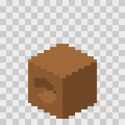

```json
{
  "type": "csg", "id": "block", "op": "subtract", "position": [0, 0.5, 0],
  "parts": [
    { "type": "box", "id": "body", "material": "stone", "size": [1, 1, 1] },
    { "type": "cylinder", "id": "hole", "material": "stone", "radius": 0.3, "height": 1.2, "rotation": [90, 0, 0] }
  ]
}
```

| `op` | Result |
|---|---|
| `union` | Everything in any operand |
| `subtract` | The first operand minus all the others |
| `intersect` | Only what every operand shares |
| `hull` | The convex hull around all operands |

Operands can be any closed parts, including groups and other CSG parts. Each triangle of the result keeps the material of the operand it came from, so cut faces show the cutter's material: the notched crate in `examples/props` uses a dark heartwood cutter. Results get creased normals. Faces meeting at more than 35 degrees keep a hard edge, and flatter ones are smoothed. An operand that is not closed fails with `E_PART_NOT_MANIFOLD`, which names the part.

## Components

A component is a reusable, parameterised list of parts in `components/<name>.json`:

```json
{
  "schemaVersion": "1.0.0",
  "name": "fence-post",
  "params": { "height": { "type": "number", "default": 1, "min": 0.3, "max": 3 }, "width": { "type": "number", "default": 0.12 } },
  "parts": [
    { "type": "box", "id": "post", "material": "oak", "size": ["${width}", "${height}", "${width}"], "position": [0, "${height / 2}", 0] }
  ]
}
```

Use it as a part:

```json
{ "type": "component", "id": "post", "component": "fence-post", "params": { "height": 0.9 }, "repeat": { "count": 4, "offset": [0.6, 0, 0] } }
```

- `"${...}"` placeholders hold arithmetic over the parameters: `+ - * / %`, parentheses, and `min`, `max`, `abs`, `floor`, `ceil`, `round` and `sqrt`. A string that is exactly one placeholder takes the value's type, so `"${height / 2}"` becomes a number.
- Parameters are checked for type, range and spelling. Unknown or missing parameters fail with `E_COMPONENT_INVALID`.
- `materials` on the component part renames component materials, as in `{ "wood": "oak" }`. A component can also ship default `materials`, which the asset and project override by name.
- Components can use other components, up to 8 levels deep. A loop fails with `E_COMPONENT_CYCLE`.
- `td2d schema component` prints the component file schema.

## Imports

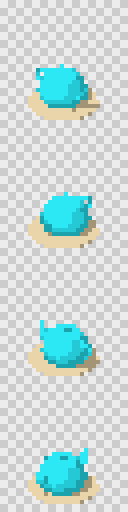

```json
{ "type": "import", "id": "teapot", "src": "import/teapot.glb", "material": "glaze", "materialMap": { "porcelain": "glaze" }, "units": 0.03, "align": "base" }
```

| Field | Meaning |
|---|---|
| `src` | A `.glb` file, relative to the asset directory, under 50 MB |
| `select` | Only these glTF node names (and their children) |
| `material` | The asset material for any glTF material not in `materialMap` |
| `materialMap` | glTF material name to asset material name |
| `units` | Metres per file unit, such as 0.01 for centimetres |
| `align` | `base` (default) puts the bottom centre of the bounds at the part origin; `centre` and `origin` are the alternatives |

Node transforms are baked in. Vertex colours (`COLOR_0`) are kept and multiply the material colour. td2d hashes imported files, so editing one rebuilds the model. Imports are rarely closed, so they cannot usually be CSG operands.

## Checking a model

```sh
td2d validate --stage model --json   # build geometry and check it, without rendering
td2d model inspect props/barrel      # bounds, triangles, materials, closedness per part
```

| Check | Result |
|---|---|
| More than 50,000 triangles | `E_MODEL_TOO_COMPLEX` |
| More than 20,000 triangles | `W_TRIANGLE_BUDGET` |
| Geometry below y = 0 | `W_MODEL_BELOW_GROUND` |
| The model leaves the frame in some direction | `W_MODEL_OUT_OF_FRAME`, with the measured span in pixels |
| A CSG operand is not closed | `E_PART_NOT_MANIFOLD` |
| The glTF validator reports an error | `E_GENERATION_FAILED` |

Zero-area triangles, such as those at lathe poles, are removed automatically.

## Writing assets in TypeScript

For repetition, maths or parameter sweeps, write a script with the SDK and emit JSON from it:

```ts
// scripts/barrel.ts
import { defineAsset, lathe, torus } from '@td2d/core/sdk';

export default defineAsset({
  id: 'props/barrel',
  type: 'prop',
  model: {
    parts: [
      lathe({ id: 'staves', material: 'oak', segments: 16, profile: [[0, 0], [0.32, 0], [0.4, 0.45], [0.32, 0.9], [0, 0.9]] }),
      torus({ id: 'hoop', material: 'iron', radius: 0.375, tube: 0.025, position: [0, 0.2, 0], repeat: { count: 2, offset: [0, 0.5, 0] } }),
    ],
  },
});
```

```sh
td2d asset emit scripts/barrel.ts            # writes assets/props/barrel/asset.json
td2d asset emit scripts/barrel.ts --print    # shows the JSON without writing
```

The SDK has a builder for every part type (`box`, `cylinder`, `cone`, `sphere`, `capsule`, `torus`, `plane`, `wedge`, `lathe`, `extrude`, `importGlb`, `group`, `union`, `subtract`, `intersect`, `hull`, `component`), plus `circlePoints`, `round` and `defineAsset`, which validates the definition.

Scripts run in a separate Node process under Node's permission model:

- they may read the project and the packages they import (by real path, so pnpm's linked packages work), and nothing else;
- they may not write files, start processes or worker threads, load native addons, or use the network (Node 24 has no network permission, so td2d replaces the network APIs in the script's process);
- they have 512 MB of memory and 30 seconds, or `--timeout <ms>`;
- they may print at most 8 MB.

A refused action fails with `E_SCRIPT_PERMISSION` naming what was tried, and nothing is written; a crash, a timeout or running out of memory fails with `E_SCRIPT_FAILED`. These limits catch mistakes in scripts you or your agent wrote; they are not a boundary against deliberately hostile code. The emitted JSON is the source of truth: `generate` never runs scripts.

## Examples

`examples/props` has one asset per feature, each with committed expected outputs:

| Asset | Shows |
|---|---|
| 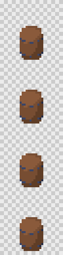 `props/barrel` | lathe, repeated torus hoops, written as an SDK script |
| 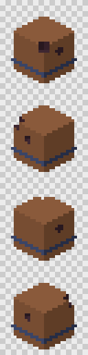 `props/crate-notched` | CSG subtract with a material-preserving cutter |
| 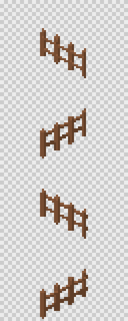 `props/fence` | a parameterised component, repeated |
| 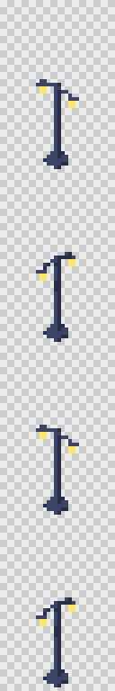 `props/lamp` | a mirrored group |
| 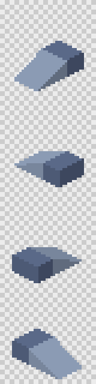 `props/ramp` | wedge, and a part colour |
| 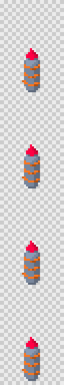 `props/totem` | capsule, torus, cone, and palette part colours |
