# Pixel art processing

The `pixel` stage turns each supersampled render into a sprite. It runs a fixed list of passes, each over every frame of the asset, so an automatic palette is built once from all frames and every frame shares it. This page explains each pass and its settings, the checks that validate the result, and indexed PNG output. The pictures come from `examples/pixel`, which generates one crate scene per setting.

## The passes

| Pass | Result | What it does |
|---|---|---|
| render | 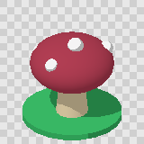 | The render, at 4 times the frame size. Antialiasing is off. |
| `downscale` (`box`) |  | Averages each 4 x 4 block. Smooth, but full of in-between colours. |
| `downscale` (`mode`, default) | 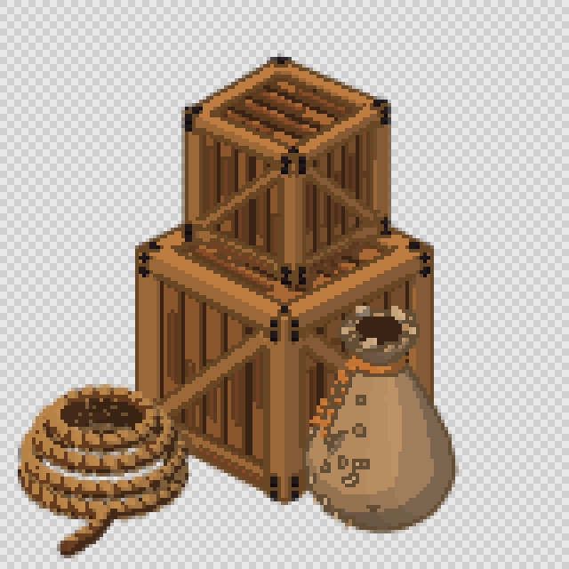 | Each pixel takes the block's most common colour, so only rendered colours appear. |
| `alphaThreshold` | 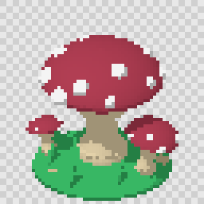 | Alpha becomes 0 or 255. |
| `posterize` | | Optional: cuts each colour channel to n levels. |
| `palette` | 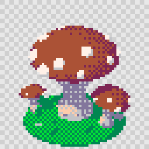 | Snaps colours to a palette, here PICO-8 with a light Bayer dither. |
| `outline` |  | Draws a one-colour ring around the silhouette. |
| `cleanup` | 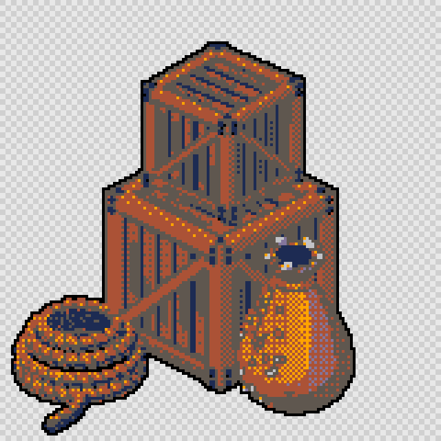 | Removes stray single pixels. |
| `bleed` | 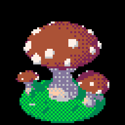 | Copies the nearest opaque colour under transparent pixels (shown here without transparency). |

Change any setting under `pixel` in the asset, a project default or a preset, then run `td2d process <id>`. It reruns `pixel` and the later stages from the cached renders, so nothing is rendered again. The one exception is an outside outline: adding or widening one changes the framing (see Outlines), so that change renders again.

```sh
td2d process palette/auto-16 --json
td2d inspect palette/auto-16 --frame idle/s/000 --json   # colour count, bounds, centroid
td2d preview palette/auto-16 --scale 6
```

Every setting below is shown with its default.

```json
{
  "pixel": {
    "downscale": "mode",
    "alphaThreshold": 128,
    "posterize": "none",
    "palette": "none",
    "paletteScope": "asset",
    "dither": "none",
    "ditherStrength": 0.5,
    "outline": "none",
    "cleanup": { "orphans": "off", "minNeighbours": 1 },
    "bleed": true
  }
}
```

## Downscale and alpha

| `mode` (default) | `box` |
|---|---|
|  | 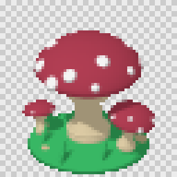 |

Both filters set a pixel's alpha from how much of its block is covered, then `alphaThreshold` makes it binary. A block exactly half covered is rounded like a GPU rasterises an edge: in on the shape's left and top edges, out on its right and bottom ones. Shapes therefore keep their size as they move by fractions of a pixel.

`mode` keeps only colours that were rendered: toon bands and material borders stay crisp, and pixels change colour less often between frames than with `box`, or than rendering at 1x. `box` averages colours, which suits smooth lambert shading that a palette pass quantises afterwards. The measurements behind this default are in `docs/roadmaps/phase-5.md` (experiment Q3).

`alphaThreshold` (default 128) decides how much of a pixel must be covered. Lower values thicken thin parts and every edge; higher values thin them. A part narrower than about one pixel, such as a sword blade seen edge on, can vanish at any threshold from 100 up. Make such parts at least `1 / pixelsPerUnit` metres thick, or lower the threshold for that asset (experiment Q6).

## Palettes

| `none` | `fixed:endesga-32` | `auto:16` | `auto:4` | `fixed:crate-8` | `posterize: 4` |
|---|---|---|---|---|---|
|  |  |  |  |  | 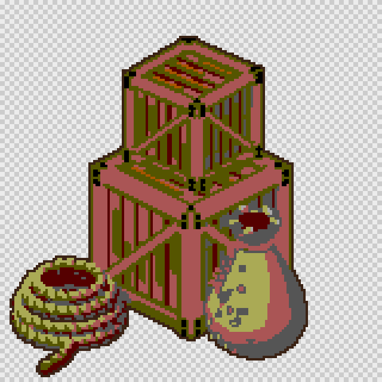 |

- **`none`** keeps rendered colours.
- **`fixed:<name>`** snaps every pixel to its perceptually nearest palette colour, measured in Oklab. Built in: `pico-8`, `endesga-32`, `db32`, `aap-64` and `resurrect-64`. Add your own as `palettes/<name>.json` with a `colors` list (`td2d schema palette`).
- **`auto:<n>`** builds an n-colour palette from the asset's own frames with Wu's quantiser, then snaps to it. The palette is the same on every run and is sorted dark to light.
- **`paletteScope`** is `asset` (default) for one automatic palette shared by all clips, or `clip` for one per clip. Per-clip palettes fit each clip slightly better, but the same pose can change colour where one clip hands over to another (experiment Q7), so td2d warns with `W_PALETTE_PER_CLIP`.
- **`posterize`** cuts each channel to 2 to 32 levels before the palette pass. It is a quick retro look without a palette.

The manifest records the palette under `palette.colors`, and under `palette.byClip` for per-clip palettes.

## Dithering

| `none` | `bayer-4`, 0.35 | `bayer-4`, 0.7 | `bayer-2`, 0.5 |
|---|---|---|---|
| 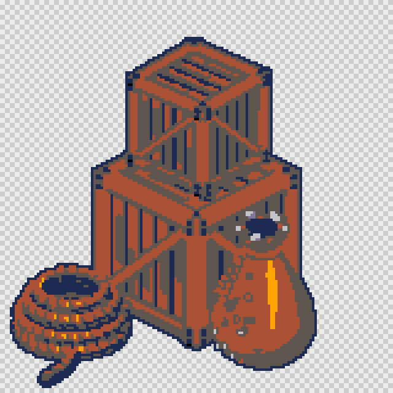 | 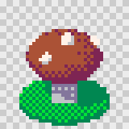 |  |  |

Dithering only applies with a palette. It is ordered (Bayer 2 x 2, 4 x 4 or 8 x 8): each pixel's colour is nudged by a threshold that depends only on its position before it is snapped. The pattern is therefore fixed to the frame and does not crawl as the sprite animates. `ditherStrength` from 0 to 1 sets how far colours may be pushed. Flat areas between two palette colours become a checker pattern, as on the crates above.

## Outlines

| outside | outside, `connectivity: 4` | inside | snapped to PICO-8 |
|---|---|---|---|
| 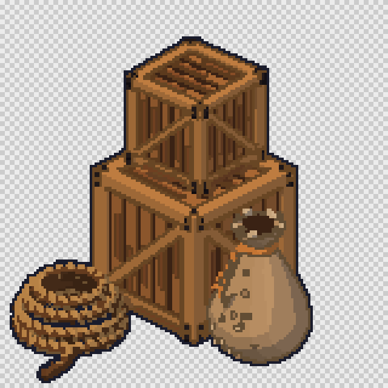 | 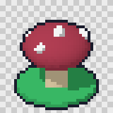 | 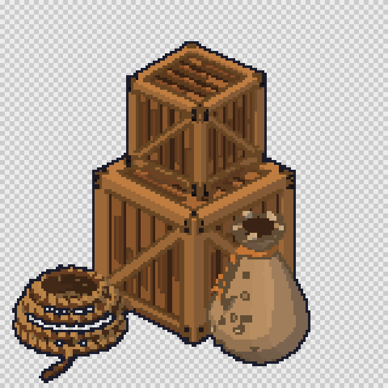 | 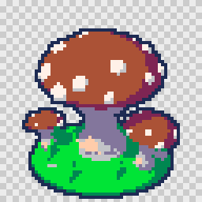 |

```json
{ "outline": { "color": "#1a1c2c", "side": "outside", "width": 1, "connectivity": 8, "snapToPalette": false } }
```

- **`side: "outside"`** paints a ring of `width` pixels around the silhouette. The plan stage leaves room for it: the automatic ground margin, `pixelsPerUnit: "auto"` and the out-of-frame warning all allow for the ring.
- **`side: "inside"`** recolours the silhouette's own edge pixels, so the sprite does not grow.
- **`connectivity`** 8 (default) closes diagonal corners; 4 leaves them open, for a softer look.
- **`snapToPalette`** replaces the colour with its nearest palette colour, so a fixed-palette sprite stays inside its palette. Otherwise the outline colour is added to the allowed colours.

## Lines inside the silhouette

The outline pass only rings the silhouette, so where an arm crosses the chest or one leg passes in front of the other, the two shapes run together. Pixel artists draw a line there. `render.lines` makes the renderer draw one:

```json
{ "render": { "lines": { "width": 1, "color": "shade", "shade": 0.35, "depth": 0.015 } } }
```

| outline only | `lines`, dark | `lines`, `shade`, with the outline |
|---|---|---|
| 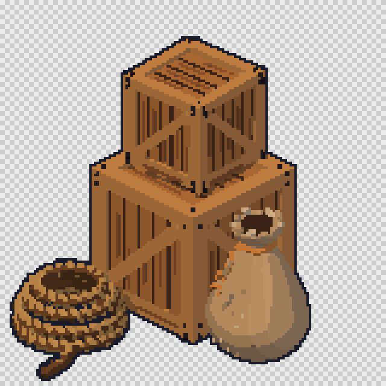 | 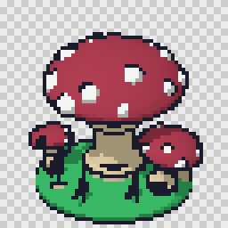 | 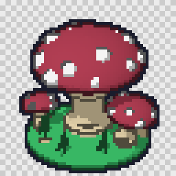 |

- **How.** After rendering, the renderer looks at the depth of every pixel. A line runs wherever the depth steps, and wherever two materials that take lines meet, so parts that touch with no step between them, a brace lying on planks, are still lined. The line always goes on the nearer side, `width` final pixels into the part in front, so it never paints over that part. Two pieces of the same material that merely join, a wrist going into a fist, get no line between them.
- **`depth`** (metres, default 0.015) is the smallest step in depth that gets a line. Steps are found from how the depth bends, not how fast it changes, so a flat surface is never lined however steeply it is tilted.
- **`color`** is one `#rrggbb` for every line, or `shade` (the default): each part's line is its own colour at `shade` brightness, so skin is lined in dark brown and cloth in its own deep tone, as hand-drawn sprites are.
- Materials with `"outline": false` get no lines and start none: use it for fine detail (grain, stitching, rope strands, eyes) and for dark gaps, or every streak and seam is lined.
- Lines are drawn into the render and survive the `mode` downscale: a block at least half covered by line becomes a line pixel. With the `box` filter they blend into their neighbours instead.
- Lines lie inside the silhouette, so they do not change the sprite's size. With the outline pass as well, the outside edge is two pixels: the line in each part's shade, then the outline.

Lines, two or three toon bands per material painted with a [ramp](materials-and-palettes.md#ramps) and `cleanup.orphans: "recolour"` together make a model read as drawn rather than rendered; `examples/fighter` uses lines, bands and cleanup.

## Cleanup and bleed

`cleanup.orphans` removes stray pixels: `remove` (or `true`) deletes opaque pixels with fewer than `minNeighbours` opaque neighbours (up, down, left, right), and `recolour` gives a single off-colour pixel the colour of its neighbours. The validation report counts what was removed or recoloured, in its `cleanup` entry.

`bleed` (default on) gives transparent pixels the colour of the nearest opaque pixel. Engines that filter or scale textures then blend edges with the sprite's own colours instead of black.

## Pass order

The default order is `downscale`, `alphaThreshold`, `posterize`, `palette`, `outline`, `cleanup`, `bleed`. Passes that are not configured do nothing. To experiment, set `pixel.passes` to another order. It must start with `downscale` and include `alphaThreshold`. For example, cleanup before outline stops the outline from saving stray pixels:

```json
{ "passes": ["downscale", "alphaThreshold", "palette", "cleanup", "outline", "bleed"] }
```

## Presets

| `retro-16` | `pico-8` |
|---|---|
| 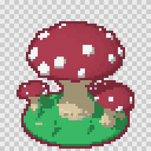 | 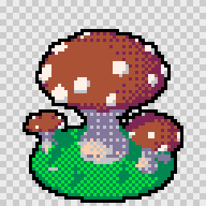 |

`"pixel": "retro-16"` uses a preset, and `{ "preset": "pico-8", "ditherStrength": 0.6 }` uses one with overrides. The built-in presets are:

- **`default`:** the defaults above.
- **`outlined`:** the defaults plus a dark one-pixel outline.
- **`retro-16`:** `auto:16`, an outline snapped into the palette, and stray-pixel removal.
- **`pico-8`:** the PICO-8 palette, `bayer-4` at 0.35, and a black outline from the palette.

Add your own as `presets/pixel/<name>.json`.

## Validation

`td2d generate` and `td2d process` check every sprite and write `build/<id>/validation.json`. The pixel checks are:

| Check | Fails or warns when | Level |
|---|---|---|
| `palette` | a pixel's colour is not in the palette (plus the outline colour, unless snapped) | fail |
| `jitter` | a frame's centre of mass moves more than `acceptance.maxJitter` px (default 2) from the previous frame | warn, or fail when `maxJitter` is set |
| `bounds-drift` | a frame's width or height differs from its clip's median by more than `acceptance.maxBoundsDrift` px | fail, only when set |
| `isolated-pixels` | a sprite has single pixels with no opaque neighbour, or more than `acceptance.maxOrphans` | warn, or fail when `maxOrphans` is set |
| `max-colors` | a sprite uses more than `acceptance.maxColors` colours | fail, only when set |

Clips that move on purpose, such as a dash, set `"motion": true` in their definition to skip the jitter check.

## Indexed PNG

With `export.png.indexed` at `auto` (default) and a palette set, sheets are written as indexed PNGs (colour type 3, with transparency in a `tRNS` chunk) at the smallest bit depth that fits. Palette order is kept, and the colours that bleeding puts under transparent pixels are kept too. td2d writes these files itself and decodes each one after writing to check it. `always` writes indexed PNGs without a palette too, whenever the sheet has at most 256 colour entries. If it needs more, the sheet is written as RGBA with the warning `W_INDEXED_UNAVAILABLE`. `never` always writes RGBA.
