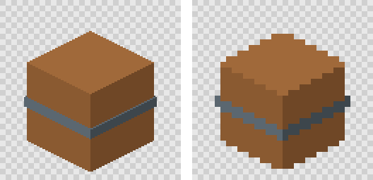

# Rendering

td2d renders with three.js inside Playwright's Chromium headless shell. The browser uses the SwiftShader software rasteriser, so no GPU is needed and the same inputs give the same pixels on every machine that runs the same browser build.

`td2d generate` renders assets as one stage of the pipeline (see [Generating sprites](generating.md)). `td2d render --glb` renders a GLB file directly, which is useful for imported models and for debugging.

Each frame renders at the frame size times `render.supersample` (4 by default) and the pixel stage reduces it to the sprite. The starter crate's render at 128 x 128, and the 32 x 32 sprite made from it, enlarged:



## Set up

```sh
td2d doctor --fix
```

`doctor` launches the browser, renders a small probe cube and reports the renderer. A healthy machine shows a line like this:

```text
ok    Headless rendering: Chromium 153.0.8010.12 renders with ANGLE (Google, Vulkan 1.3.0 (SwiftShader Device (LLVM 10.0.0) (0x0000C0DE)), SwiftShader driver) in 662 ms.
```

`--fix` installs the Chromium headless shell that matches td2d's Playwright version. It never removes browsers installed for other projects. On Linux the browser also needs system libraries:

```sh
npx playwright install-deps chromium
```

## Render a GLB

```sh
td2d render --glb crate.glb --out frames --directions d8 --frame 32x32 --ground-margin 6
```

Frames are written to `<out>/<clip or static>/<direction>/<nnn>.png` at the frame size times `--supersample` (default 4). These are raw renders. Turning them into pixel-art sprites is the pixel stage: see [Pixel art processing](pixel-art.md).

| Option | Default | Meaning |
|---|---|---|
| `--directions` | `d4` | `d1`, `d1-side`, `d4`, `d8`, `d16`, or compass names such as `s,w,n,e` |
| `--frame` | `32x32` | Final sprite size in pixels |
| `--supersample` | `4` | Render scale factor |
| `--ppu` | `16` | Pixels per metre in the final sprite |
| `--camera` | `dimetric` | Camera preset |
| `--ground-margin` | `auto` from the preset | Pixels between the pivot line and the bottom edge; `auto` fits the model |
| `--lighting` | `studio-toon` | Lighting preset |
| `--clip`, `--times` | none | Animation clip and sample times in seconds |
| `--allow-hardware` | off | Use the GPU if present. Faster, but output depends on the machine |

`--out` must be new, empty, or a directory td2d created before. td2d marks its output directories with a `.td2d-output` file and refuses to write anywhere else.

## Camera, lighting and framing

[Camera, lighting and composition](camera-and-lighting.md) covers presets, directions, mirroring, scale, ground margin, lights, toon bands and ground shadows. [Rigging and animation](rigging-and-animation.md) covers rigs, clips and generators.

## Materials

In the pipeline, materials are applied by name at render time from the asset definition. For `--glb` renders, the renderer reads td2d shading from each glTF material's `extras.td2d` block:

| `shading` | three.js material | Look |
|---|---|---|
| `toon` (default) | `MeshToonMaterial` with a `bands`-step ramp and nearest filtering | Hard light bands |
| `flat` | `MeshBasicMaterial` | Unlit base colour |
| `lambert` | `MeshLambertMaterial` | Smooth diffuse lighting |

Base colours are stored linear in the GLB, as glTF requires, and the output is sRGB. A flat material renders as exactly the colour written in the definition.

## Reproducibility

These settings are fixed so renders repeat exactly: no antialiasing, unfiltered shadow maps, nearest texture filtering, no tone mapping, and no time or randomness in the scene code.

| Comparison | Result |
|---|---|
| Same machine, separate browser launches | Byte-identical |
| macOS arm64 against Linux arm64 and Linux x86_64 | Byte-identical for every golden render and for the starter crate sheet (x86_64 measured under emulation) |
| SwiftShader against a hardware GPU (`--allow-hardware`) | Edge pixels differ |

Visual regression tests compare raw renders with a tolerance of 0.5 percent of pixels at pixelmatch threshold 0.1. Sprites, sheets and every exported file of the examples are compared exactly.

## Backends

| Backend | How it renders | Output |
|---|---|---|
| `playwright-swiftshader` (default) | three.js in Playwright's Chromium headless shell, rasterised by SwiftShader on the CPU | Byte-identical on every machine with the same td2d |
| `headless-gl` (optional) | The same harness scene in Node on a headless-gl WebGL2 context, without a browser | Drawn by ANGLE on the machine's own graphics stack. Within 0.03 % of the default on the goldens, but not guaranteed identical across machines |

Choose one per asset, or project-wide in `defaults`:

```json
{ "render": { "backend": "headless-gl" } }
```

headless-gl is an optional peer dependency. Install it next to td2d and check it with `td2d doctor`:

```sh
npm install gl@9.0.0-rc.10      # builds a native module: needs a C++ toolchain where no prebuilt binary exists
td2d doctor                     # "Optional headless-gl backend" passes, with the renderer it found
xvfb-run -a td2d generate props/crate   # on Linux it needs a display; xvfb provides one
```

Every frame rendered with it warns with `W_HARDWARE_RENDERER`, since the pixels can differ between machines; keep the default for anything that must match across machines, such as CI comparisons. Its cache keys differ from the default backend's, so switching renders again rather than reusing frames.

## Troubleshooting

| Symptom | Cause and fix |
|---|---|
| `E_BROWSER_MISSING`, exit 7 | Run `td2d doctor --fix`. |
| `E_BACKEND_UNAVAILABLE` mentioning WebGL2 | On Linux, install system libraries with `npx playwright install-deps chromium`. |
| `W_HARDWARE_RENDERER` | `--allow-hardware` was set and a GPU was used. Drop it for reproducible output. |
| `W_FRAME_CLIPPED` on the bottom edge | Raise `--ground-margin` or lower `--ppu`. |
| `E_RENDER_FAILED` naming a clip | The GLB has no clip with that name. `td2d render --json` lists the model's clips under `data.model.clips`. |
