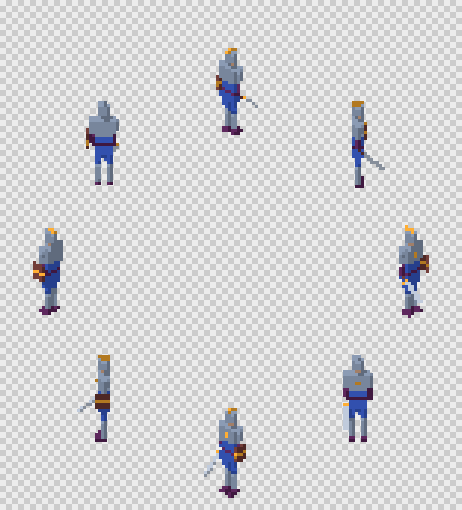
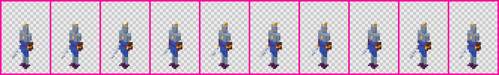
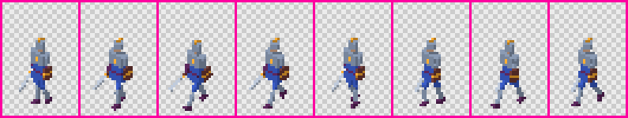
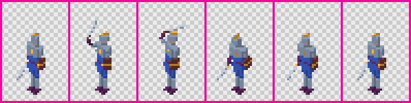

# Rigging and animation

An animated asset has a rig (a tree of bones), parts that follow those bones, and clips that pose the bones over time. The `rig` stage turns the rig and clips into glTF bones and animations; the renderer then samples each clip at the frame times. This page covers rigs, attaching parts, skinning, clips, generators and the checks. The pictures come from `examples/characters`.



## Rigs

```json
{ "type": "character", "rig": "humanoid-basic" }
```

| Preset | Bones |
|---|---|
| `humanoid-basic` | 15 VRM 1.0 humanoid bones for a figure about 1.8 m tall facing +Z, arms down. Left is +X. |
| `quadruped-basic` | 14 bones for an animal about 0.7 m tall, body along Z: `hips`, `spine`, `chest`, `neck`, `head`, `tail`, `front-left-upper`, `front-left-lower`, `front-right-upper`, `front-right-lower`, `back-left-upper`, `back-left-lower`, `back-right-upper`, `back-right-lower`. |
| `none` | No bones: turns off a rig set by project defaults. |

### Humanoid bones

Positions are the rest positions of each joint in metres, relative to the parent joint. Limits are the allowed pose rotation in degrees (Euler X, then Y, then Z) and only produce a warning.

| Bone | Parent | Position | Limits |
|---|---|---|---|
| `hips` | root | 0, 0.95, 0 | none |
| `spine` | `hips` | 0, 0.12, 0 | x [-45, 60], y [-45, 45], z [-30, 30] |
| `chest` | `spine` | 0, 0.2, 0 | x [-30, 45], y [-30, 30], z [-20, 20] |
| `neck` | `chest` | 0, 0.22, 0 | x [-40, 40], y [-60, 60], z [-30, 30] |
| `head` | `neck` | 0, 0.08, 0 | x [-40, 40], y [-70, 70], z [-30, 30] |
| `leftUpperArm` | `chest` | 0.2, 0.17, 0 | x [-180, 60], y [-90, 90], z [-90, 180] |
| `leftLowerArm` | `leftUpperArm` | 0, -0.28, 0 | x [-150, 0], y [-90, 90], z [-10, 10] |
| `rightUpperArm` | `chest` | -0.2, 0.17, 0 | x [-180, 60], y [-90, 90], z [-180, 90] |
| `rightLowerArm` | `rightUpperArm` | 0, -0.28, 0 | x [-150, 0], y [-90, 90], z [-10, 10] |
| `leftUpperLeg` | `hips` | 0.1, -0.05, 0 | x [-120, 60], y [-45, 45], z [-30, 60] |
| `leftLowerLeg` | `leftUpperLeg` | 0, -0.42, 0 | x [0, 150], y [-10, 10], z [-10, 10] |
| `leftFoot` | `leftLowerLeg` | 0, -0.4, 0 | x [-45, 45], y [-30, 30], z [-20, 20] |
| `rightUpperLeg` | `hips` | -0.1, -0.05, 0 | x [-120, 60], y [-45, 45], z [-60, 30] |
| `rightLowerLeg` | `rightUpperLeg` | 0, -0.42, 0 | x [0, 150], y [-10, 10], z [-10, 10] |
| `rightFoot` | `rightLowerLeg` | 0, -0.4, 0 | x [-45, 45], y [-30, 30], z [-20, 20] |

Positive X rotation of a leg or arm bone swings the limb backwards (towards -Z); negative swings it forwards. Positive X on a lower leg bends the knee.

### Changing a rig

```json
{
  "rig": {
    "preset": "humanoid-basic",
    "scale": 0.6,
    "bones": [
      { "name": "hips", "position": [0, 0.55, 0] },
      { "name": "sword", "parent": "rightLowerArm", "position": [0, -0.3, 0] }
    ]
  }
}
```

- **`scale`** multiplies every bone position defined so far, for a smaller or larger figure.
- **`bones`** change bones by name (position, parent, rotation, limits) or add new ones. A new bone needs a `parent`, or `null` for the root. A rig has exactly one root.
- **Layers.** `rig` can sit in project `defaults` or `typeDefaults`, like other settings. A preset name in a later layer starts the rig again from that preset; an object changes the rig so far. `examples/characters` sets `"rig": "humanoid-basic"` for every character in `typeDefaults.character`.
- **Project presets** go in `presets/rig/<name>.json` (`td2d schema rig-preset`). `td2d rig list` lists all presets, and `td2d rig show <id>` prints an asset's bones with their positions and attached parts.

Bone names are VRM camelCase (`leftUpperArm`) or lowercase kebab-case (`tail-tip`).

## Attaching parts

```json
{ "type": "capsule", "id": "thigh", "bone": "leftUpperLeg", "material": "cloth", "radius": 0.07, "length": 0.28, "position": [0.1, 0.69, 0], "mirror": "x" }
```

- Model parts in their rest position, in model space, as for a static asset. `bone` makes a part follow that bone rigidly.
- Children of a `group` or `component` inherit its `bone` (and `skin`); a child can set its own.
- A copy made by `"mirror": "x"` swaps left and right in every bone it names, so one leg definition gives both legs. Bones inherited from above the mirrored part are not swapped.
- A CSG result moves as one piece: set `bone` on the `csg` part, not on its operands.
- Parts without a bone follow the root bone.

## Skinning

Rigid parts are the default and suit sprites at 32 to 64 px: at that size, experiment Q5 found that skinning an elbow changed at most 12 of about 100 pixels. For a part that should bend smoothly across a joint, use a skin:

```json
{ "type": "capsule", "id": "arm", "skin": "two-bone-blend", "skinBones": ["leftUpperArm", "leftLowerArm"], "material": "skin", "radius": 0.05, "length": 0.5, "heightSegments": 16, "position": [0.22, 1.18, 0] }
```

- **`nearest-bone`** gives each vertex to its nearest bone.
- **`two-bone-blend`** shares vertices near a joint between the two bones that meet there, so the joint bends smoothly; away from joints each vertex follows one bone.
- **`skinBones`** limits which bones may move the part. Without it every bone of the rig is a candidate.
- **`heightSegments`** on cylinders and capsules adds rings along the length. A skinned part only bends where it has vertices.

## Clips

```json
{
  "animation": {
    "fps": 10,
    "clips": {
      "idle": { "duration": 1, "generator": { "type": "idle-breathe" } },
      "walk": { "duration": 0.8, "generator": { "type": "walk-cycle", "stride": 25, "bob": 0.065 } },
      "attack": { "duration": 0.5, "loop": false, "motion": true, "keys": [
        { "t": 0, "pose": {}, "easing": "ease-out" },
        { "t": 0.2, "pose": { "rightUpperArm": { "rotation": [-115, 0, -10] }, "rightLowerArm": { "rotation": [-90, 0, 0] } }, "easing": "ease-in-cubic" },
        { "t": 0.3, "pose": { "rightUpperArm": { "rotation": [-25, 0, 0] } } },
        { "t": 0.5, "pose": {} }
      ] }
    }
  }
}
```

| Field | Meaning |
|---|---|
| `duration` | Length in seconds. Frames = duration x fps. A duration that is not a whole number of frames warns with `W_CLIP_FRAME_PERIOD`. |
| `loop` | Default true. A looping clip leaves out its last frame so playback wraps cleanly, and runs from its last key back to its first. A one-shot clip (`false`) renders both ends. |
| `fps` | Overrides `animation.fps` for this clip. |
| `sampleTimes` | Render exactly these times instead of evenly spaced frames. |
| `motion` | The model moves on purpose (an attack, a dash), so the jitter check skips the clip. |
| `keys` or `generator` | How the clip poses the bones. Without either the clip shows the rest pose. |
| `interpolation` | `linear` (default) or `step`. |

**Keys.** Each key is a whole pose at time `t`: a bone the key does not list is at its rest pose. A pose sets `rotation` (Euler degrees, or a quaternion `[x, y, z, w]`), `translation` (metres added to the rest position, in the parent bone's frame) and `scale`, all relative to the rest pose. Between keys a bone moves with the earlier key's `easing`: `linear`, `step`, `ease-in`, `ease-out`, `ease-in-out`, `ease-in-cubic`, `ease-out-cubic`, `ease-in-out-cubic` or `ease-in-out-sine`.

**Interpolation.** `linear` moves smoothly between keys. `step` holds every key until the next one, like hand-drawn key frames. Experiment Q4 found that at 10 fps a walk keyed with four poses and `step` freezes on every other frame and then jumps; `linear` changes the same amount every frame and stays much closer to the true motion. Use `step` only for a deliberately held, choppy look.

Clips are baked at their frame times into glTF animations, so every rendered frame is exactly the pose the keys describe.

| idle | walk | attack |
|---|---|---|
|  |  |  |

## Generators

Generators write keys for you, one per frame. `td2d model inspect <id> --clip walk --keys --json` prints them, which is a good starting point for hand-made keys.

### walk-cycle

| Parameter | Default | Meaning |
|---|---|---|
| `stride` | 25 | Leg swing either side of vertical, in degrees. |
| `bob` | 0.03 | How far the hips drop when the legs are furthest apart, in metres. |
| `armSwing` | 20 | Arm swing opposite the legs, in degrees. |
| `kneeBend` | 30 | Knee bend of the leg swinging forward, in degrees. |
| `hipSway` | 4 | Hip twist towards the forward leg, in degrees; the spine twists back. |
| `lean` | 0 | Forward lean of the spine, in degrees. |
| `bones` | VRM names | Bone for each role: `hips`, `spine`, `leftUpperLeg`, `rightUpperLeg`, `leftLowerLeg`, `rightLowerLeg`, `leftFoot`, `rightFoot`, `leftUpperArm`, `rightUpperArm`. Only the hips and upper legs are required. |

A foot should stay on the ground: with straight legs, a stride of S degrees lifts a foot by about leg length x (1 - cos S), and `bob` should match it. The plan stage checks that in every frame the lowest foot point is within one pixel of the ground. Otherwise it warns with `W_CLIP_FOOT_CONTACT`, and the hint gives a `bob` for your stride.

### idle-breathe, bob and spin

| Generator | Parameters (defaults) | Moves |
|---|---|---|
| `idle-breathe` | `amount` 2 degrees, `rise` 0.01 m, `bones.chest`, `bones.shoulders` | The chest (or spine) tilts back and lifts once per clip; the upper arms settle by half the rise. |
| `bob` | `height` 0.05 m, `bone` | Rises and falls once per clip, easing in and out. |
| `spin` | `turns` 1, `axis` y, `bone` | Turns at a constant rate. Negative turns go the other way. |

## Animating props

An asset without a rig can still animate as a whole. `bob` and `spin` move the whole model by default, and keys can pose the bone named `root`:

```json
{ "animation": { "clips": { "spin": { "duration": 0.8, "generator": { "type": "spin" } } } } }
```

## Rendering and checking clips

```sh
td2d model inspect characters/knight --json            # bones, attachments, clips
td2d render characters/knight --clips walk --directions s,w
td2d render characters/knight --frames walk/s/0-2 --frames attack/*/3
td2d preview characters/knight --clip walk --scale 4   # one row of frames per direction
```

`--frames` takes `clip/direction/frames` with `*` for any, such as `walk/s/0-2`. Filtered renders stop at the render stage.

Changing a clip reruns `rig` and the stages after it; the geometry stays cached. The frame is fitted to every rendered pose, so `pixelsPerUnit: "auto"` and the automatic ground margin keep a sword swung overhead inside the frame.

| Problem | Reported as |
|---|---|
| A part, key or generator names a bone that is not in the rig | `E_ASSET_INVALID`, at the exact path |
| A key time after the end of the clip, or keys out of order | `E_ASSET_INVALID` |
| A pose turns a bone past its limits | `W_CLIP_BONE_LIMIT` |
| A walk-cycle foot off or into the ground | `W_CLIP_FOOT_CONTACT` |
| A frame's centre jumps more than `acceptance.maxJitter` px | the `jitter` check, skipped for `motion` clips |
