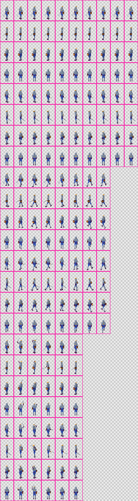
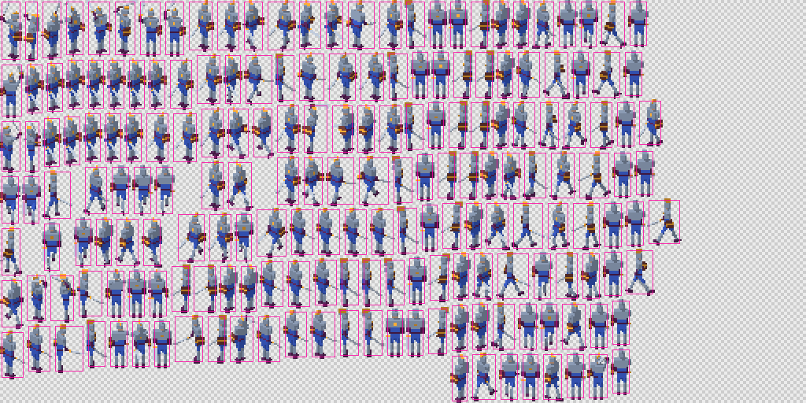

# Sprite sheets

The `sheet` stage places every sprite on one or more sheet images, and the `export` stage writes the data files that describe them. This page covers the layouts and their settings. [Export formats](../reference/export-formats.md) covers the data files and how to load them into engines, and [the manifest](../reference/manifest.md) is the tool-native description of every sheet and cell.

## Layouts

| `grid` (default) | `packed` |
|---|---|
|  |  |
| One row per clip and direction, one column per frame. 320 x 1152 for the knight. | Sprites trimmed to their opaque pixels and packed with maxrects. 512 x 256 for the same frames. |

- **`grid`** is predictable: a cell's place follows from its clip, direction and frame number. `flow: "columns"` turns it so each sequence runs down a column.
- **`strips`** writes a separate sheet for each clip and direction, such as `knight-walk-s.png`.
- **`packed`** uses the least space. With `trim` each sprite is cut to its opaque pixels and the cut is recorded, so engines draw it in the right place. Packing is deterministic: the same sprites always give the same sheet.

```json
{ "sheet": "packed" }
```

```json
{ "sheet": { "layout": "grid", "split": "clip", "padding": 1, "extrude": 1 } }
```

| Setting | Default | Meaning |
|---|---|---|
| `layout` | `grid` | `grid`, `strips` or `packed`. |
| `order` | `clip-direction` | Sequence order: each clip's directions together, or each direction's clips together (`direction-clip`). |
| `flow` | `rows` | grid and strips: sequences run along rows, or down columns. |
| `split` | `none` | `clip` or `direction`: a separate sheet for each, named `<asset>-<clip>` or `<asset>-<direction>`. |
| `trim` | false | packed only: cut sprites to their opaque pixels. |
| `padding` | 0 | Transparent pixels between cells. |
| `extrude` | 0 | Pixels of each cell's edge copied outwards, for engines that filter textures so neighbouring cells never bleed in. |
| `powerOfTwo` | false | Round sheet sizes up to powers of two. |
| `maxSize` | 4096 | Largest sheet edge. A layout that needs more splits into numbered sheets: `knight-0.png`, `knight-1.png`. |

Presets: `grid` (the defaults), `packed` (trim, padding 1, extrude 1, power-of-two sheets) and `strips`. Add your own as `presets/sheet/<name>.json`.

### Splitting

Sheets never split a clip and direction: a grid breaks between sequences, and packing adds whole sequences to a sheet while they still fit on it. One sequence too big for `maxSize` is an error that suggests `packed`, a split, or a larger `maxSize`. Every format that supports several images (the manifest, Aseprite JSON per sheet, PixiJS with `related_multi_packs`, the Phaser multi-atlas and the Godot resource) lists all of them.

### Trimming and pivots

A trimmed cell records its `offset`: where its top-left pixel lies inside the untrimmed frame. The pivot is always given in untrimmed frame coordinates, so to draw a cell with the pivot at a point P, draw it at P - pivot + offset. Engines do this for you from `spriteSourceSize` (Aseprite, PixiJS, Phaser) or the AtlasTexture `margin` (Godot). The test suite rebuilds every trimmed cell into its frame and checks that every visible pixel lands where it was.

## Commands

```sh
td2d sheet characters/knight --json             # lay out again from cached sprites (after changing sheet settings)
td2d export characters/knight --format pixi,godot-spriteframes --json
td2d inspect characters/knight --cells --json   # every cell: sheet, rectangle, trim offset, mirrored
td2d preview characters/knight-packed --sheet 0 --scale 2
```

`td2d sheet` reruns the sheet stage and later ones; `td2d export` reruns only the export stage, and with `--format` writes those formats instead of the asset's own. Both reuse every render.

## Checks

Validation checks that every sheet image has the size its layout planned (`sheet-size`), that every cell and its extruded border lie inside its sheet (`cells-in-bounds`), and that every planned frame appears exactly once (`frame-count`). Every exported JSON file is checked against its schema as it is written.
