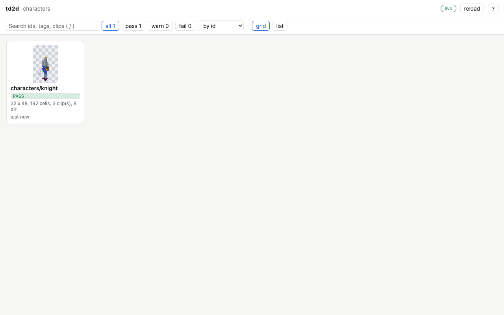
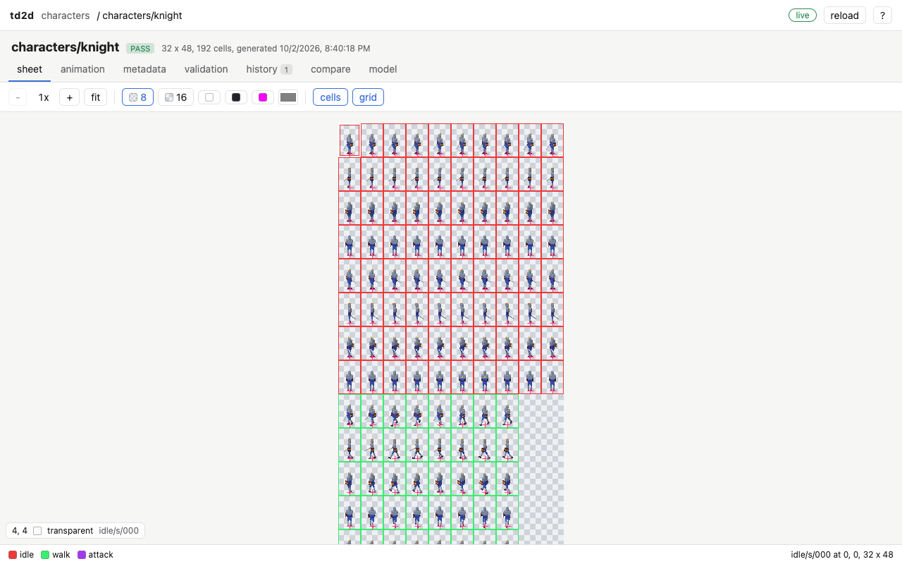
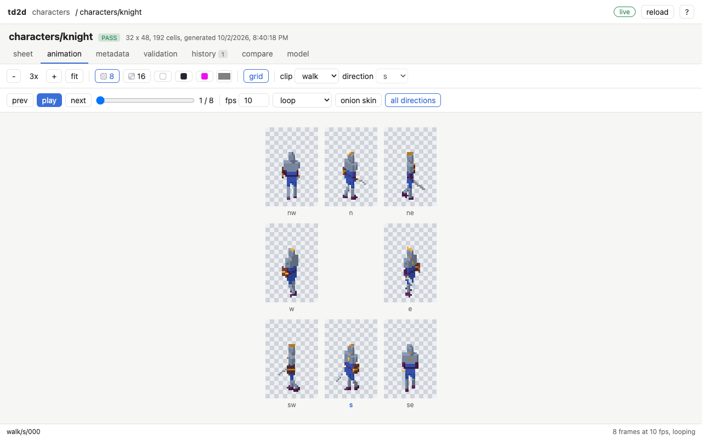
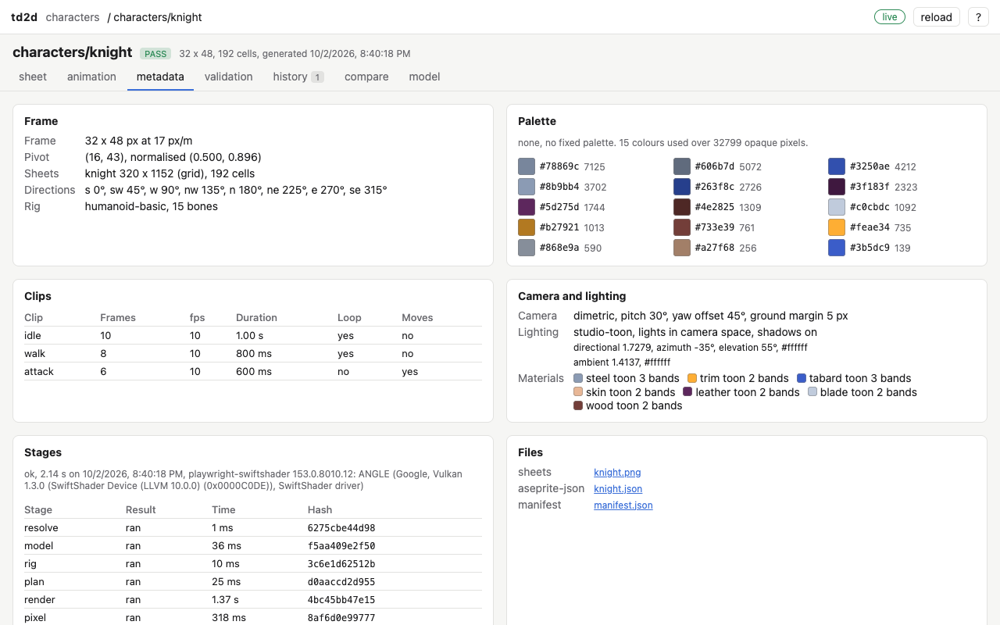
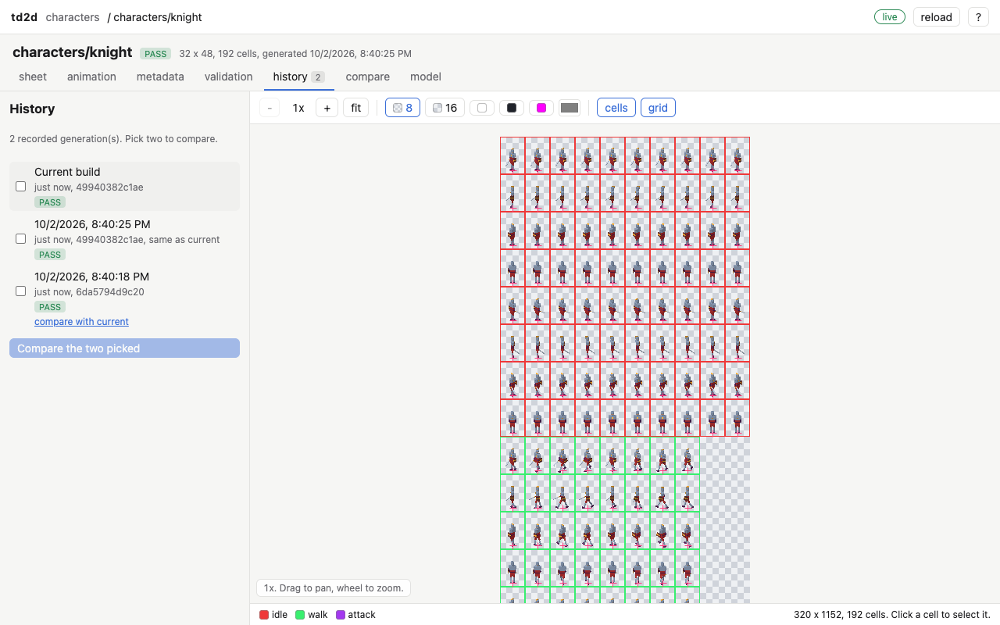
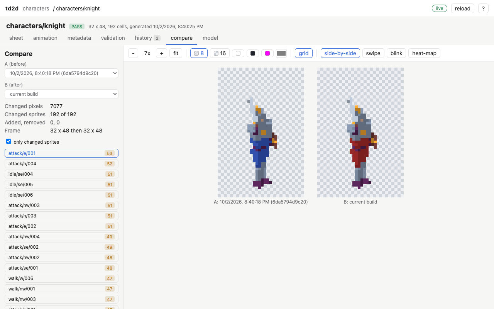
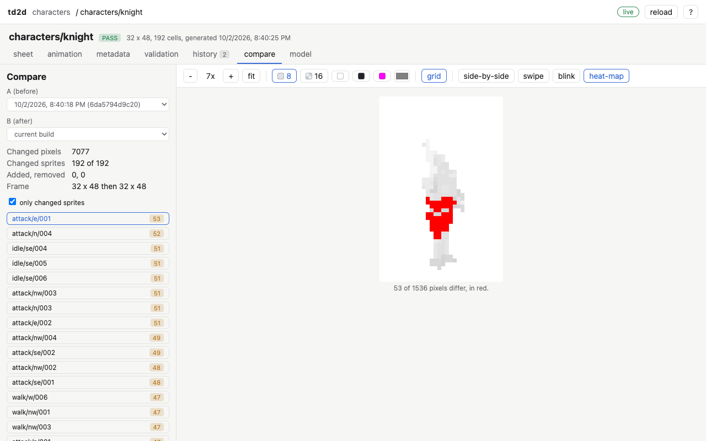
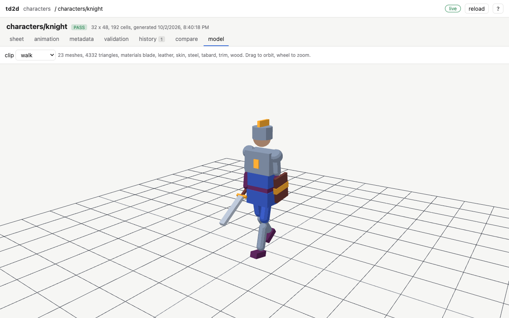
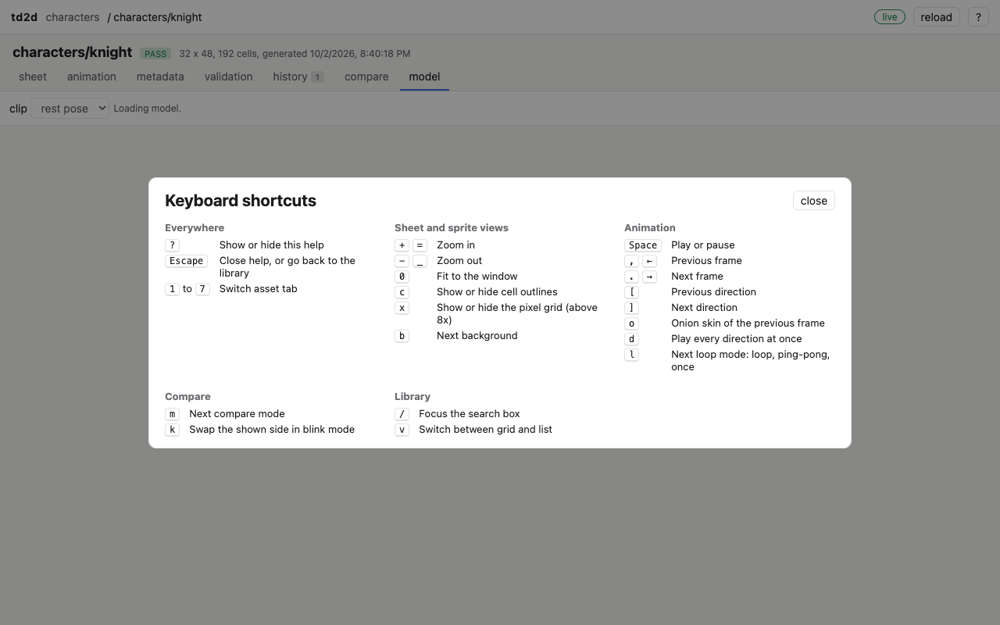

# The web viewer

`td2d viewer` serves a read-only web page for looking at everything in `build/`: each asset's sheet at exact pixel zoom, its animations, metadata, validation results, history, and differences between generations. It is for people; agents read the same files directly or use `td2d inspect`, `td2d preview` and `td2d compare`.

```sh
td2d viewer --open                 # http://127.0.0.1:4747, opened in the default browser
td2d viewer --port 0 --json        # pick a free port; the URL is logged on stderr
td2d viewer --no-watch             # no live reload
td2d viewer --watch-mode poll      # for mounts that deliver no file events
```

The viewer never writes to the project. It watches `build/` and updates the page within a second of a regeneration: the asset's card in the library is outlined, and an open asset reloads in place. The badge at the top right says `live` while changes stream in, `not watching` with `--no-watch`, and `static` for a site written by `td2d index`.

The screenshots on this page are written by the viewer's end-to-end test (`TD2D_DOCS_IMAGES=1 pnpm vitest run --project e2e packages/cli/e2e/viewer.test.ts`), against the knight from `examples/characters`.

## Library



Every generated asset, with a thumbnail of its first frame, its validation status, size, clip and direction counts, and how long ago it was generated. Search matches every word you type against ids, types, tags and clip names. The buttons filter by validation status, the tag menu by tag, and the sort menu orders by id, newest first or failures first. `v` switches between the grid and a list, and `/` jumps to the search box. The search and layout are remembered in the browser.

## Sheet



The whole sheet on a canvas at an integer zoom from 1x to 32x. Each cell is outlined in its clip's colour (the legend names them), pivots are marked with small crosses, and clicking a cell selects it and shows its rectangle, trim offset and whether it was mirrored. Packed layouts with several pages get a tab per page.

- **Zoom** with the wheel (about the pointer), `+` and `-`, or `0` to fit the window.
- **Pan** by dragging.
- **Backgrounds**: an 8 or 16 px checkerboard, white, dark, magenta, or any colour from the picker. `b` steps through them.
- **Pixel grid**: `x` toggles a line between pixels, drawn above 8x.
- **Cells**: `c` hides or shows the outlines and pivots.
- **Hover readout**: the pixel under the pointer, its colour, its alpha when partly transparent, and its index in the asset's palette (the clip's own with `paletteScope: "clip"`).

Only the visible part of a sheet is drawn, so a 4096 px sheet at 32x is as quick as a small one.

## Animation



Plays one clip in one direction at the clip's frame rate.

| Control | Keys |
|---|---|
| Play and pause | Space |
| Previous and next frame | `,` and `.`, or the arrow keys |
| Scrub | the slider |
| Previous and next direction | `[` and `]` |
| Frame rate override | the fps box; "reset" returns to the clip's rate |
| Loop, ping-pong or once | the loop menu, or `l` |
| Onion skin of the previous frame | `o` |
| Every direction at once | `d`: a compass grid for eight directions, a row otherwise |

Playback keeps exact time: at 10 fps it shows 10 frames a second whatever the display's refresh rate, and a one-shot clip (`loop: false`) stops on its last frame.

## Metadata



The frame size and scale, the pivot in pixels and normalised, each sheet's size and layout, the directions with their yaw, and the rig. The palette section counts every colour actually used over all cells, in the browser, with each colour's index in the asset palette and any palette colours no sprite uses. Then the clip table, the camera, the lights and materials the renderer used, every stage with whether it ran or came from the cache, its time and its hash, any warnings, and links to every exported file.

## Validation

Every check from `validation.json`, failures first. Choosing a check that names frames highlights those cells on the sheet in red, and clicking a frame name selects that cell. Passing checks are hidden unless you ask for them.

## History and compare



Each generation that changed the outputs is copied into `history/<id>/` (see [Generating sprites](generating.md)). The history tab lists them, newest first, with the current build at the top; entries identical to the current build are marked. Click an entry to see its sheet, tick two to compare them, or follow "compare with current".



The compare tab rebuilds every sprite of both generations at frame size, so it works across layout changes, and counts what changed: changed pixels, changed sprites, sprites added and removed. The count is the same one `td2d compare` reports. The list on the left ranks sprites by changed pixels; pick one to view it in one of four modes (`m` steps through them):

- **side by side**;
- **swipe**: drag the divider between A and B;
- **blink**: alternates twice a second, and `k` swaps by hand;
- **heat map**: changed pixels in red over a faded copy.



## Model



An orbit view of `build/<id>/rig/model.glb` (or `model/model.glb` without a rig) with the same materials the renderer uses and the asset's lights. Lights set in camera space turn with the view, as they turn with each rendered direction. The clip menu plays the model's animations. three.js is loaded only when this tab opens, so it costs nothing elsewhere.

## Keyboard



`?` shows every shortcut. `1` to `7` switch tabs, and `Escape` closes the overlay or returns to the library. Shortcuts do nothing while you type in a text box.

## Sharing a build without td2d: static mode

```sh
td2d index                         # writes build/index.html, build/index.json and build/_td2d/
npx serve build                    # or any static file server
td2d index --out /tmp/site         # a separate directory, with the outputs it needs copied
td2d index --no-history            # leave out history (History and Compare are then empty)
```

`td2d index` writes the same page as a static site: `index.json` lists the assets, `_td2d/data/` holds one JSON file per asset and history entry, and `_td2d/history/` copies the history entries the compare tab needs. The page looks for the td2d server first and falls back to these files, so every tab works the same except that nothing updates live. Run `td2d index` again after generating. It replaces only files it wrote and refuses to overwrite an `index.html` of your own.

## Watching in containers and on network drives

The viewer uses `fs.watch` with `recursive: true`. On macOS, on Linux, and in Docker containers (including bind mounts written from the host) it noticed changes within about 130 ms in testing; see the [Phase 9 notes](../roadmaps/phase-9.md). If a mount delivers no file events, as some network file systems do, `--watch-mode poll` checks every 200 ms instead. The reload button refreshes by hand in any mode.

## Troubleshooting

| Symptom | Fix |
|---|---|
| "The td2d viewer client has not been built" | Run `pnpm build` in the td2d repository. |
| "Cannot listen on 127.0.0.1:4747" (`E_USAGE`) | Another program has the port: pass `--port 0` or another port. |
| The badge says `reconnecting` | The server stopped. Start `td2d viewer` again; the page reconnects by itself. |
| A regenerated asset does not update | Check the badge: with `not watching`, use reload; on a network mount, try `--watch-mode poll`. |
| "There is nothing to compare yet" | The asset has one recorded generation. Change it and generate again. |
