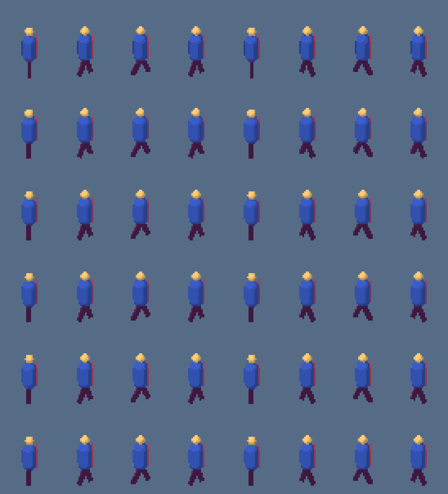
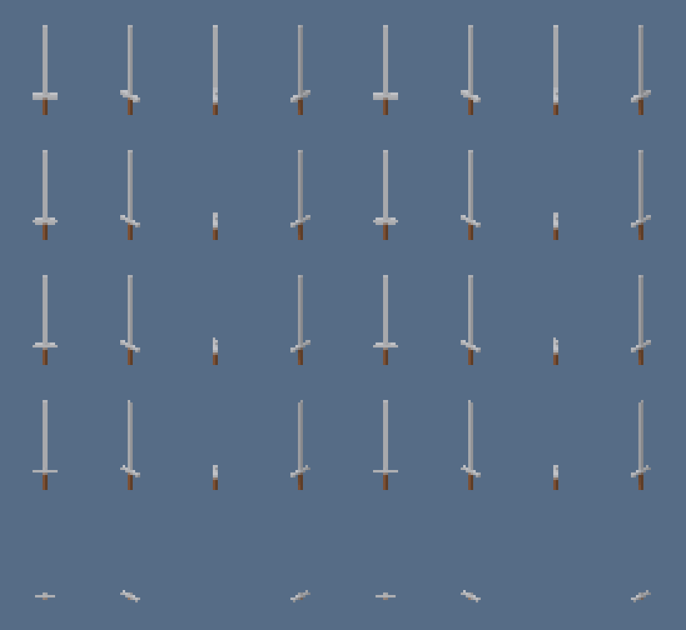
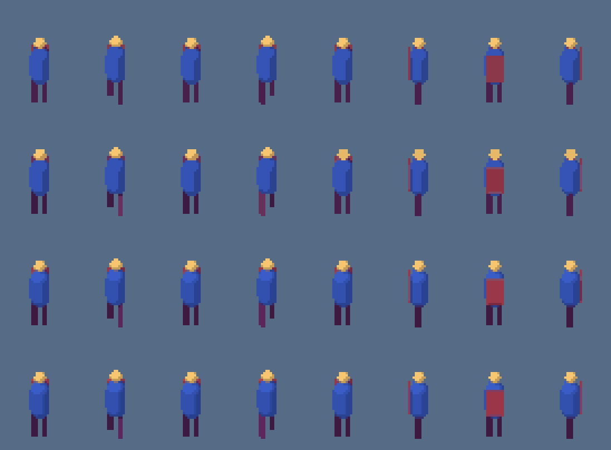

# Phase 5 notes: pixel-art processing

Status: complete locally on 2026-10-02.

## Acceptance criteria

| Criterion | Evidence |
|---|---|
| A fixed palette keeps every opaque pixel in the palette, and its indexed PNG opens in the viewer and in a standard image tool | render test "keeps a fixed-palette walk inside the palette": validation passes, and the indexed PNG decodes to identical pixels in sharp (libvips) and in Chromium, which is what the viewer uses. The e2e test for `td2d process` checks colour type 3 and the `palette` check on a real sheet. |
| `auto:16` yields at most 16 colours plus transparency | unit test "auto:16 gives at most 16 colours shared by every frame"; `examples/pixel` asset `palette/auto-16` with `acceptance.maxColors: 16` |
| The outline pass adds exactly one ring pixel around every opaque region | unit test "draws an exact one-pixel ring outside the silhouette", checked pixel by pixel |
| The pixel stage for a 32 x 48 frame from a 128 x 192 render runs under 5 ms | unit test with an auto palette, dither, outline and cleanup over 16 frames; about 0.4 ms per frame measured |
| Jitter validation flags injected 3 px centroid jumps and passes the walking fixture | render test on the walker fixture: `walk` passes with `maxJitter: 2`; the `jitter` clip, shifted 3 px on odd keys, warns by default and fails with `maxJitter: 2` on every affected frame |
| Experiment results are recorded with images and the chosen defaults are justified | sections Q3, Q6, Q7 and Q8 below; `pnpm experiments` reruns them |

## Experiments

`pnpm experiments` runs `packages/core/test/experiments/phase-5.experiment.ts`. It writes the images below and `docs/roadmaps/assets/phase-5/metrics.json`, then asserts the conclusions recorded here, so a change that overturns one fails. The fixtures are in `packages/core/test/fixtures/models.ts`: a capsule walker with swinging legs and a cape, with `walk`, `turn`, `slide` and `jitter` clips, and a sword with a 5 cm x 2 cm blade.

### Q3: supersampling against 1x rendering

Walker, 32 x 48 at 16 px/m, eight views. `walk` has 8 frames; `slide` moves the standing figure about 2 px in 16 frames, either in exact 1/8 px steps or in 0.13 px steps.

| Variant | Walk edge variance | Slide area variance | Centroid step error (px) | Pixels changing colour per frame | Colours per sprite | Render ms per frame |
|---|---|---|---|---|---|---|
| 1x | 22.0 | 9.4 | 0.118 | 3.4% | 9.9 | 1.2 |
| 2x box | 17.7 | 11.5 | 0.126 | 9.6% | 34 | 1.5 |
| 4x box | 22.0 | 12.5 | 0.121 | 22% | 56 | 2.9 |
| 8x box | 22.5 | 11.7 | 0.122 | 33% | 66 | 8.7 |
| 4x mode | 22.0 | 12.5 | 0.121 | 2.8% | 10.1 | 2.8 |
| 8x mode | 22.5 | 11.7 | 0.122 | 2.5% | 10.0 | 8.7 |

Slide values are for the 0.13 px steps; the 1/8 px steps give the same picture (`metrics.json`).

Findings:

- Silhouettes are about equally steady at every supersample factor. The roadmap's metric (edge-pixel count variance over a walk) does not separate them, and neither do area variance or centroid accuracy over a sub-pixel slide.
- The first measurement showed 4x silhouettes growing and shrinking by a column as they moved (area variance 31). The cause was rounding: a block exactly half covered averages to alpha 127.5, which rounded up, so both edges of a shape grew at once. The box filter now breaks that tie with the GPU top-left rule (in on left and top edges, out on right and bottom ones), which brought it to 12.5.
- Colour is where supersampling matters. Box averaging blends toon bands and material borders into in-between colours, which change from frame to frame as the model moves: 22% of pixels at 4x against 3.4% at 1x, and 56 colours per sprite against 10.
- The new `mode` filter takes each block's most common colour. It keeps only rendered colours and changes colour least often (2.8%), while keeping coverage-based alpha.

Decision: keep `render.supersample: 4`, and make `pixel.downscale: "mode"` the default. `box` stays available for smooth lambert shading that a palette quantises afterwards. 8x costs three times as much as 4x for no measurable gain.

### Q6: alpha threshold on thin parts

Sword in eight views at 32 px/m: the blade is 1.6 px wide face on and 0.6 px edge on.

| Threshold | Views in pieces | Blade rows missing | Opaque pixels per sprite |
|---|---|---|---|
| 64 | 0 | 0% | 86 |
| 100 | 0 | 23% | 70.5 |
| 128 | 0 | 23% | 68.8 |
| 160 | 0 | 24% | 66 |
| 192 | 2 empty | 98% | 11 |

From 100 to 160 the result barely changes: the blade disappears in the two edge-on views (the 23%) and is whole elsewhere. Only 64 keeps the edge-on blade, and it does so by thickening every edge (86 pixels against 69). Decision: keep 128, which treats a pixel as opaque when at least half of it is covered and so preserves area. The pixel-art guide tells authors to make parts at least one pixel thick (`1 / pixelsPerUnit` metres) or lower the threshold for that asset.

### Q7: one automatic palette per asset or per clip

Walker `walk` and `turn` clips, south view, box downscale so each sprite has about 50 colours. Both clips start in the same pose.

| Palette | Mean Oklab error, walk | Mean Oklab error, turn | Pixels that change colour between the clips' identical first frames | Distinct colours |
|---|---|---|---|---|
| `auto:6`, asset | 0.0290 | 0.0310 | 0 | 6 |
| `auto:6`, clip | 0.0251 | 0.0322 | 205 | 12 |
| `auto:12`, asset | 0.0116 | 0.0135 | 0 | 12 |
| `auto:12`, clip | 0.0092 | 0.0125 | 192 | 23 |

Per-clip palettes lower the error slightly, but the same pose changes colour where one clip hands over to another, and the asset as a whole ends up with twice the colours. Decision: `paletteScope: "asset"` is the default; `clip` stays available. The manifest records per-clip palettes under `palette.byClip`. Phase 6 repeats this with real animation clips.

### Q8: indexed PNG encoding and the libimagequant licence

Eight walker frames snapped to PICO-8 with a Bayer dither, as one 256 x 48 strip:

| Encoder | Bytes | ms | Pixels changed | Bleed colours kept | Deterministic |
|---|---|---|---|---|---|
| in-house indexed writer | 585 | 0.28 | 0 | all | yes |
| in-house, bleed colours dropped | 499 | | | | |
| sharp `palette: true` | 469 | 0.61 | 0 | none | yes |
| sharp RGBA | 766 | 0.56 | 0 | | |

Licence: sharp 0.35.5 bundles libvips 8.18.7 with libimagequant 2.4.1 from the `lovell/libimagequant` fork, which is BSD 2-Clause. The GPL applies only to later upstream releases, so sharp's palette output carries no GPL obligation. libvips itself is LGPL-3.0-or-later and dynamically linked.

Decision: write indexed PNGs with the in-house encoder (`packages/core/src/render/png-indexed.ts`). It keeps the palette order, keeps the colours that edge bleeding puts under transparent pixels (sharp merges them into one transparent entry, which defeats bleeding), involves no quantiser, and is verified by decoding every file after writing. Like for like the sizes are within a few percent of sharp's: sharp is 6% smaller on this strip, and the in-house writer was 3% smaller over the eight `examples/props` sprites. Row filters were tried and made files larger, so rows are stored unfiltered. Keeping bleed colours costs 15 to 25% in size.

## Decisions

- **In-house Wu quantiser.** `image-q`'s WuQuant took about 7 ms per frame, because it keeps a four-dimensional histogram that includes alpha. Palette pixels are always opaque, so `packages/core/src/pixel/wu.ts` implements Wu's 1991 algorithm over RGB: 0.07 ms per frame, and lower Oklab error than image-q at 4, 8, 16 and 32 colours on the example sprites (for example 0.0036 against 0.0048 at 16). `image-q` is no longer a dependency.
- **Mode downscale is the default** (Q3). Every example's expected output was regenerated. Colour counts dropped sharply (the teapot from 151 to 5, the dimetric cottage from 136 to 10), with silhouettes almost unchanged.
- **Top-left tie rule in the box filter** (Q3). Exactly half-covered blocks round towards the shape on left and top edges and away on right and bottom ones, so moving shapes keep their size.
- **Outside outlines get room in the frame.** The first `examples/pixel` run showed outlined sprites touching the bottom edge, because the automatic ground margin only covered the model. The plan stage now reserves the outline width in the automatic ground margin, in `pixelsPerUnit: "auto"` and in the out-of-frame warning. Adding an outside outline therefore re-plans and re-renders, which `td2d process` reports.
- **`retro-16` snaps its outline into the palette,** so the preset really uses at most 16 colours.
- **`W_PALETTE_PER_CLIP`** warns when clips get separate automatic palettes, as the roadmap's risk list planned.
- **Cleanup counts** are reported as a `cleanup` entry in `validation.json`, and `acceptance.maxOrphans` (new) turns the isolated-pixel warning into a failure.
- **Jitter** uses the centroid of opaque pixels between consecutive frames of each clip and direction. It warns above 2 px by default and fails when `acceptance.maxJitter` is set. Clips that move on purpose set `motion: true`.
- **Pass registry.** Passes are objects with an id and a version in a registry, run in `pixel.passes` order (see `packages/core/src/pixel/pipeline.ts`). Each pass runs over all frames at once, which lets the palette pass build one automatic palette from every frame. Pass versions are part of the pixel stage's cache key.
- **Stage versions.** plan 4 (outline pad), pixel 4 (new passes, tie rule), validate 3 (new checks), export 2 (indexed PNG and palette in the manifest).

## Deviations

- The roadmap sketched `pixel/passes/*` and `pixel/palette/*` directories. The passes are small, so they live in `pixel/passes.ts`, `pixel/palette.ts`, `pixel/oklab.ts` and `pixel/wu.ts`, with the registry and runner in `pixel/pipeline.ts`.
- The roadmap planned to wrap `image-q` and to base the PNG writer on `pngjs`. Both are in-house instead, for the speed and output reasons above; the PNG writer needs only `node:zlib`.
- `mirror` is not a pixel pass: mirrored directions are flipped after the passes run, as in Phase 4, so mirrored cells match their sources exactly.

## Measurements

| Measurement | Value |
|---|---|
| Pixel passes for one 32 x 48 frame from a 128 x 192 render | box 0.05 ms, mode 0.14 ms, Wu palette 0.07 ms, palette mapping with dither 0.10 ms, outline 0.02 ms, cleanup 0.03 ms, bleed 0.01 ms |
| Automatic palette build | 7 ms per frame with image-q, 0.07 ms in-house |
| Tests | 409 across unit, render, harness and e2e projects, plus 4 experiments |

## Examples

`examples/pixel` generates one mushroom per setting: `mode` and `box` downscale, five palettes (none, Endesga 32, `auto:16`, `auto:4` and the project palette `toadstool-7`), posterize, four dither settings, four outline styles and the `retro-16` and `pico-8` presets. Its expected outputs are committed and regenerated byte for byte by the test suite. `docs/guide/pixel-art.md` uses its images.
