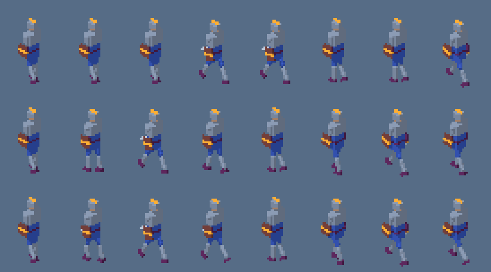
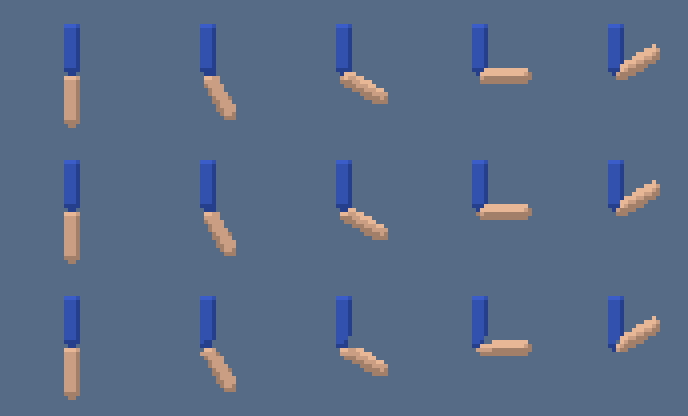

# Phase 6 notes: rigging and animation

Status: complete locally on 2026-10-02.

## Acceptance criteria

| Criterion | Evidence |
|---|---|
| The knight example generates an 8-direction, 3-clip sheet with validation pass and jitter under threshold | e2e test "generates an 8-direction, 3-clip sheet": 192 cells (idle 10, walk 8, attack 6 frames in 8 directions), validation pass with `acceptance.maxJitter: 2`; the expected outputs are committed and regenerated byte for byte |
| Changing a clip key reruns `rig` and later stages while `model` stays cached | the same e2e test edits an attack key and checks model `cached`, rig, plan and render `ran`; unit test "rerig without rebuilding geometry when a clip changes" |
| `walk-cycle` foot contact passes for the example; too large a stride triggers `W_CLIP_FOOT_CONTACT` | the knight generates with no warnings; the e2e test sets stride 50 and gets the warning; unit tests check that the hint's suggested `bob` removes it |
| `AnimationMixer` sampling of the same clip at the same time in two separate renders is byte-identical | render test "samples the same clip time to identical bytes in separate renders" |
| Q4 and Q5 recorded, defaults set | sections Q4 and Q5 below |

## Experiments

`pnpm experiments` also runs `packages/core/test/experiments/phase-6.experiment.ts`, which writes `docs/roadmaps/assets/phase-6/` and asserts the conclusions below.

### Q4: step or linear between keys

The knight's walk, keyed with four poses taken from the walk-cycle generator (contact, passing, contact, passing) and rendered at 10 fps (8 frames). The generated walk, exact at every frame, is the reference.

| Interpolation | Pixels changed per frame (mean, view w) | Largest change | Frames identical to the next | Spread of changes (std / mean) | Pixels off the true walk |
|---|---|---|---|---|---|
| step | 114 | 232 | 4 of 8 | 1.00 | 162 |
| linear | 160 | 173 | 0 | 0.07 | 33 |
| generated | 157 | 193 | 0 | 0.17 | 0 |

Step holds each key for two frames, so the walk freezes on every other frame and then jumps twice as far. Linear changes the silhouette by an even amount each frame, much like the real motion. Reviewing the strips, the linear walk reads as walking; the stepped one looks like a stutter at this frame rate. Decision: `interpolation: "linear"` is the default; `step` stays for deliberately held poses.

### Q5: rigid parts or skinning at 32 px

An arm of two capsules on a two-bone rig, the same geometry in every mode, bent 0 to 120 degrees at the elbow, 32 x 32 side view.

| Mode | Pixels differing from rigid at 0, 30, 60, 90, 120 degrees | Opaque pixels |
|---|---|---|
| rigid | 0, 0, 0, 0, 0 | 100 to 94 |
| nearest-bone | 0, 0, 2, 1, 0 | 100 to 94 |
| two-bone-blend | 0, 7, 12, 9, 8 | 100 to 95 |

At 32 px skinning changes a handful of pixels around the elbow and nothing else; the bend reads the same. Decision: parts are rigid by default and skinning is opt-in per part, as the roadmap planned. Skinning is worth it for a part that would otherwise show a visible seam, such as a sleeve over a joint at larger sizes.

### Q7 again: palettes on real clips

The knight's idle, walk and attack with box downscale and `auto:8`: per-asset mean Oklab error 0.0323, per-clip 0.0328. The rest-pose first frames of idle and attack, identical in pose, differ in 266 pixels with per-clip palettes and in none with one palette. Real clips share their colours, so per-clip palettes buy nothing and add flicker at clip changes. `paletteScope: "asset"` stays the default.

## Decisions

- **A `rig` stage** between `model` and `plan`. The model stage puts geometry that moves together in one glTF node (`model`, `part:<bone>` or `skin:<part id>`) without knowing the rig; the rig stage adds bone nodes, re-parents the part nodes under their bones (offset by the inverse rest transform, so they stay put at rest), writes skins, and bakes every clip. A rig-less, unanimated model passes through byte for byte, so no static asset's output changed.
- **Clips are baked at the frame times and the clip end.** Generators produce one key per frame, so rendered poses are exact; easing lives in td2d, and the renderer only samples.
- **Keys are whole poses**: a bone a key does not list is at rest at that key. This is the reading of "missing bones hold the rest pose" that keeps keys independent of each other.
- **Poses evaluated in Node.** `rig/evaluate.ts` applies glTF animations and skins on the CPU. The plan stage uses it to fit the frame and the ground margin over every rendered pose (the knight's sword swing sets its scale) and for the foot-contact check.
- **Mirroring across x swaps left and right** in bone names, so one limb definition makes both.
- **Props animate without a rig** through a root node: `bob` and `spin` move the whole model, and keys can pose `root`.
- **`bob` is explicit.** The walk-cycle's hip drop is a parameter (default 0.03 m, the roadmap's example) rather than computed from the leg length, so a mismatched stride is reported rather than hidden; the warning's hint computes the bob that fits.
- **Skin weights.** Each bone is the segments from its joint to its children; a leaf bone continues its parent's direction for its parent's length. two-bone-blend shares a vertex between two bones only within 15% of the shorter bone's length of the joint. The first version used inverse-squared distance everywhere and the elbow golden showed the forearm shrinking and bending half as far; a second fix gave leaf bones an extent, without which a forearm vertex was always tied between the two bones.
- **One-shot clips hold their last pose.** The harness played clips with three.js's default repeat, so a sample at exactly the clip's end showed the first pose; the arm golden at t = 1 s caught it. Actions now play once and clamp.
- **Frame filters** (`--clips`, `--directions`, `--frames clip/dir/range`) are part of the plan stage key and stop runs at render; Phase 8 adds per-sample caching so filtered and full runs share renders.
- **Stage versions**: model 3 (attachment nodes), rig 1, plan 5 (posed fitting, filters, foot contact), render 2 (renders the rigged model).

## Deviations

- The roadmap sketched `rig/generators/*`; the four generators share helpers and live in `rig/generators.ts`, described with their schemas by `td2d describe`.
- Rotation limits produce a warning (`W_CLIP_BONE_LIMIT`) rather than an error, because generators can legitimately approach them and the limits in the presets are approximate.
- Cylinders and capsules gained `heightSegments`, which skinned parts need in order to bend.

## Examples

`examples/characters` holds the knight: 17 part definitions (27 parts after mirroring) on 15 bones, an `idle-breathe` idle, a `walk-cycle` walk with `bob` set from the contact hint, and a four-key attack with easing, in 8 directions at `pixelsPerUnit: "auto"` (17 px/m, set by the attack's reach). `docs/guide/rigging-and-animation.md` uses its images.

## Measurements

| Measurement | Value |
|---|---|
| Knight cold generation (192 frames, 3 clips, 8 directions) | about 1.8 s |
| Tests | 449 across unit, render, harness and e2e projects, plus 7 experiments |

## Linux

The render, pipeline and example suites (53 tests, including the rigged arm goldens and the knight example) pass in the Playwright Linux image on arm64 and on x86_64 under emulation, and every example regenerates byte for byte against the outputs recorded on macOS.
