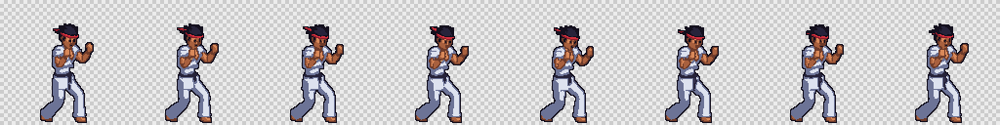
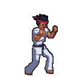
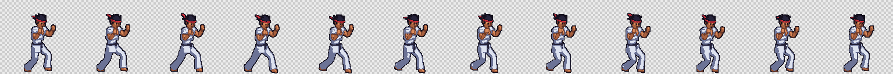
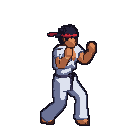
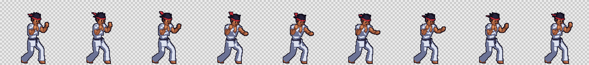
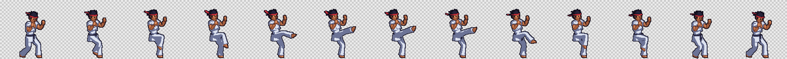
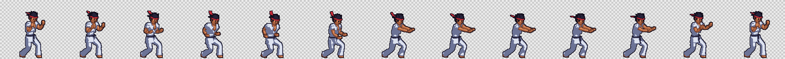
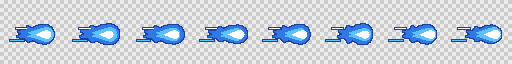

# Fighting game example

A side-on fighting game: `fighters/karateka`, a martial artist with spiky hair, a red headband, a
white gi with torn sleeves and a black belt, and `effects/energy-ball`, the blast his special
launches. Everything below is shown at the sprites' own size.

| Clip | Animation | Every frame |
|---|---|---|
| `idle`: a bouncing fighting stance, guard up (8 frames) |  |  |
| `walk`: walking forward in stance, the feet sliding in turn (12 frames) |  |  |
| `punch`: a lead jab, the chest opening as the front fist snaps out (9 frames) |  |  |
| `kick`: a high front kick off the rear leg: chamber, snap out, chamber, set down (13 frames) |  |  |
| `special`: gather energy at the hip, then thrust both palms forward (13 frames) |  |  |

The energy blast, which the game moves across the screen:

| Animation | Every frame |
|---|---|
|  |  |

The animations are the project's `gif-preview` exports: the project sets
`"export": { "formats": ["aseprite-json", "gif-preview"], "gif": { "scale": 1 } }`, so
`td2d generate` writes one looping GIF per clip next to each sheet.

## How it is set up

- **Camera.** 2D fighting games draw their characters three quarters towards the viewer, not in
  strict profile: you see the chest, both fists and the legs splayed towards you. Characters use
  the `side` preset turned 30 degrees (`"yawOffset": 30`) and tilted down 10, so the fighter
  stands at that angle while still facing right; a strict side view of a body is what makes a
  sprite look like a 3D model. Effects keep the straight side view. The `d1-side` direction set
  gives one facing, which the engine flips for the other side of the screen.
- **One scale.** `pixelsPerUnit` is fixed at 56 in the project `defaults`, rather than fitted, so
  the fighter and the blast come out at the same scale and line up in the game. That makes the
  fighter about 100 pixels tall, the height of classic fighting-game sprites, where every pixel
  counts and the outline carries the shape; much larger and he reads as a downscaled render. The
  fighter gets a 128 x 128 frame and effects 64 x 64, from `typeDefaults`.
- **Drawn, not rendered.** Each arm and each trouser leg is one smooth shape, a lathe whose
  profile carries the muscles, elbow, knee and cuff, skinned across both bones of the limb with
  `two-bone-blend`. It bends at the joint the way a drawn limb does, instead of meeting there as
  two pieces, so nothing gives away the cylinders and spheres underneath. `render.lines` draws a
  line around every part in a dark shade of the part's own colour; its `depth` of 2 cm lines an
  arm across the chest or one leg over the other but not the places where pieces join. The gi,
  hair, belt and headband have two toon bands, light and shadow, and the skin three, so surfaces
  are flat cel-shaded shapes instead of gradients. `cleanup.orphans: "recolour"` gives stray
  single pixels their neighbours' colour.
- **Lit like a fighting game.** The key light comes from the front right, the side the fighter
  faces, so his chest and face are lit; a warm rim light from behind lifts his back edges.
  `palettes/dojo.json` holds ramps for skin, the cool-shadowed white gi, ink black, headband red,
  hand wraps and blue energy, with one outline colour.
- **Model.** The body is the `fighter` component, in fighting-game proportions: a broad chest and
  shoulders over a narrow waist, thick arms, big fists and feet. The head is drawn a third larger
  than life, a group scaled about the neck joint, with three rings of hair spikes. The face is a
  simple cartoon one that reads at sprite size: two tall dark eyes with clear skin round them, a
  nose and a short mouth. Smooth hulls of spheres give the chest, jaw, fists and feet; the gi jacket is a hull
  with a V cut from its front, whose cut faces draw the lapels, and an outer flap crossing it. The
  sleeves are torn into ragged points. The headband and belt tails ride extra bones added to
  `humanoid-basic` in the project's `typeDefaults.character.rig`.
- **The blast** is flat: three extruded outlines (a deep blue flame, a light blue glow and a white
  core) stacked towards the camera, unlit, with speed streaks behind and a blue outline in place
  of the near-black one. Each layer rides its own bone; keys pulse their scale and drift the
  streaks back.

## The clips are written with the SDK

`scripts/karateka.ts` writes `assets/fighters/karateka/asset.json`:

```sh
td2d asset emit scripts/karateka.ts --overwrite
td2d generate
```

Each clip is a few poses with easing between them, posed at every frame, at 16 frames a second.
Planted feet are solved with two-bone IK in the side plane, so they stay on the floor however far
the hips drop or drive forward; a foot that leaves the floor, like the kicking leg, is posed by
its joint angles. With the camera already turned three quarters, the stance turns the chest only a
little further towards the viewer, and the head turns further still, chin a little down, so both
eyes show while he still faces his opponent. Every clip layers `sway`
generators over its keys, so the headband and belt tails flutter, harder in the attacks.

`expected/` holds the committed outputs; the test suite regenerates them byte for byte, and checks
that the script still emits exactly the committed definition.
